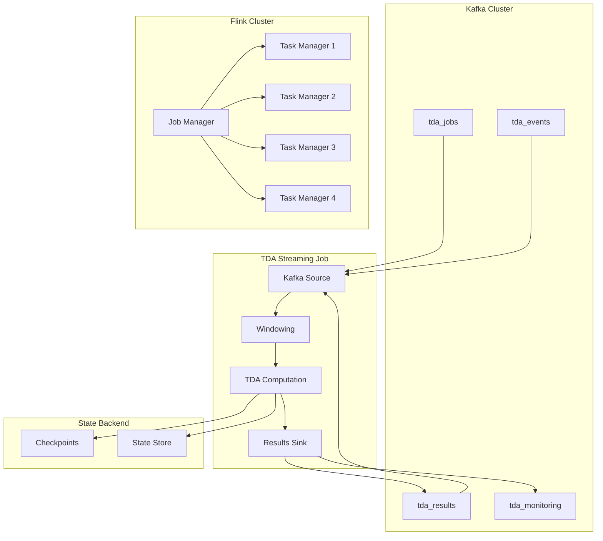

# Flink Stream Processing Jobs

Real-time TDA computation pipeline using Apache Flink for scalable stream processing of topological data analysis workloads.

## 🌊 Flink Integration Overview

### **Stream Processing Architecture**



### **Processing Pipeline Design**

| Stage | Purpose | Technology | Parallelism |
|-------|---------|------------|------------|
| **Source** | Event ingestion from Kafka | FlinkKafkaConsumer | 4 slots |
| **Windowing** | Time-based data aggregation | Tumbling/Sliding Windows | 8 slots |
| **Computation** | Real-time TDA algorithms | C++ binding + Python UDF | 16 slots |
| **Sink** | Result output to Kafka/Storage | FlinkKafkaSink | 4 slots |

## 📋 Job Configuration

### **Main Streaming Job**

```python
# /backend/flink/jobs/tda-streaming-job.py
import logging
from datetime import datetime, timedelta
from typing import List, Dict, Any, Optional

from pyflink.datastream import StreamExecutionEnvironment
from pyflink.datastream.connectors import FlinkKafkaConsumer, FlinkKafkaSink
from pyflink.datastream.formats.json import JsonRowDeserializationSchema, JsonRowSerializationSchema
from pyflink.table import StreamTableEnvironment
from pyflink.datastream.functions import ProcessWindowFunction, ProcessFunction
from pyflink.datastream.window import TumblingProcessingTimeWindows, SlidingProcessingTimeWindows
from pyflink.common.time import Time
from pyflink.common.serialization import SimpleStringSchema
from pyflink.common.typeinfo import Types

# TDA Core integration
import tda_core_py

logger = logging.getLogger(__name__)

class TDAComputation:
    """Real-time TDA computation engine for Flink streams."""
    
    def __init__(self, config: Dict[str, Any]):
        self.config = config
        self.tda_engine = tda_core_py.TDAEngine()
        self.metrics = {
            "processed_windows": 0,
            "computation_time_total": 0.0,
            "error_count": 0,
            "last_processing_time": None
        }
    
    def compute_persistence(self, point_cloud: List[List[float]], algorithm: str) -> Dict[str, Any]:
        """Compute persistence homology for point cloud."""
        try:
            start_time = datetime.now()
            
            # Configure algorithm parameters
            params = self._get_algorithm_params(algorithm)
            
            # Execute TDA computation
            if algorithm == "vietoris_rips":
                result = self.tda_engine.compute_vietoris_rips(
                    points=point_cloud,
                    max_edge_length=params.get("max_edge_length", 2.0),
                    max_dimension=params.get("max_dimension", 2),
                    num_threads=params.get("num_threads", 4)
                )
            elif algorithm == "alpha_complex":
                result = self.tda_engine.compute_alpha_complex(
                    points=point_cloud,
                    max_alpha_value=params.get("max_alpha_value", 1.0),
                    max_dimension=params.get("max_dimension", 2)
                )
            else:
                raise ValueError(f"Unsupported algorithm: {algorithm}")
            
            # Update metrics
            computation_time = (datetime.now() - start_time).total_seconds()
            self.metrics["processed_windows"] += 1
            self.metrics["computation_time_total"] += computation_time
            self.metrics["last_processing_time"] = computation_time
            
            return {
                "persistence_pairs": result.persistence_pairs,
                "betti_numbers": result.betti_numbers,
                "computation_time_ms": computation_time * 1000,
                "algorithm": algorithm,
                "num_points": len(point_cloud),
                "timestamp": datetime.now().isoformat()
            }
            
        except Exception as e:
            self.metrics["error_count"] += 1
            logger.error(f"TDA computation failed: {e}")
            raise
    
    def _get_algorithm_params(self, algorithm: str) -> Dict[str, Any]:
        """Get algorithm-specific parameters from configuration."""
        return self.config.get("algorithms", {}).get(algorithm, {})

class TDAWindowFunction(ProcessWindowFunction):
    """Window function for aggregating and processing TDA events."""
    
    def __init__(self, computation_engine: TDAComputation):
        self.computation_engine = computation_engine
        self.processed_windows = 0
    
    def process(self, key, context, elements):
        """Process windowed elements for TDA computation."""
        try:
            # Aggregate point cloud data from window
            point_cloud = []
            algorithm = "vietoris_rips"  # Default algorithm
            window_metadata = {
                "window_start": context.window().start,
                "window_end": context.window().end,
                "event_count": 0
            }
            
            for element in elements:
                event_data = element
                if "points" in event_data:
                    point_cloud.extend(event_data["points"])
                if "algorithm" in event_data:
                    algorithm = event_data["algorithm"]
                window_metadata["event_count"] += 1
            
            # Skip empty windows
            if not point_cloud:
                logger.warning(f"Empty point cloud in window {context.window()}")
                return
            
            # Ensure minimum point count for meaningful computation
            if len(point_cloud) < 3:
                logger.warning(f"Insufficient points ({len(point_cloud)}) for TDA computation")
                return
            
            # Compute TDA
            tda_result = self.computation_engine.compute_persistence(
                point_cloud=point_cloud,
                algorithm=algorithm
            )
            
            # Enrich result with window metadata
            enriched_result = {
                **tda_result,
                "window_metadata": window_metadata,
                "stream_processing": {
                    "window_id": f"{context.window().start}-{context.window().end}",
                    "processing_time": context.currentProcessingTime(),
                    "watermark": context.currentWatermark()
                }
            }
            
            # Emit result
            yield enriched_result
            self.processed_windows += 1
            
            logger.info(f"Processed window {self.processed_windows}: "
                       f"{len(point_cloud)} points, "
                       f"{len(tda_result['persistence_pairs'])} persistence pairs")
            
        except Exception as e:
            logger.error(f"Window processing failed: {e}")
            # Emit error event for monitoring
            yield {
                "error": True,
                "error_message": str(e),
                "window_metadata": window_metadata,
                "timestamp": datetime.now().isoformat()
            }

class EventFilterFunction(ProcessFunction):
    """Filter and route TDA events based on type and content."""
    
    def __init__(self):
        self.filtered_count = 0
        self.passed_count = 0
    
    def process_element(self, value, ctx):
        """Filter events for TDA processing."""
        try:
            # Parse event
            if isinstance(value, str):
                import json
                event = json.loads(value)
            else:
                event = value
            
            # Check if event contains TDA-relevant data
            if self._is_tda_event(event):
                self.passed_count += 1
                yield event
            else:
                self.filtered_count += 1
                logger.debug(f"Filtered non-TDA event: {event.get('type', 'unknown')}")
                
        except Exception as e:
            logger.error(f"Event filtering failed: {e}")
            self.filtered_count += 1
    
    def _is_tda_event(self, event: Dict[str, Any]) -> bool:
        """Determine if event is relevant for TDA processing."""
        event_type = event.get("type", "")
        payload = event.get("payload", {})
        
        # Include events with point cloud data
        if "points" in payload or "point_cloud" in payload:
            return True
        
        # Include specific event types
        tda_event_types = {
            "point_cloud_update",
            "streaming_data",
            "real_time_computation",
            "file_processed"
        }
        
        return event_type in tda_event_types

def create_streaming_job():
    """Create and configure the main TDA streaming job."""
    
    # Environment setup
    env = StreamExecutionEnvironment.get_execution_environment()
    env.set_parallelism(4)
    env.enable_checkpointing(30000)  # Checkpoint every 30 seconds
    
    # Configure state backend
    env.get_checkpoint_config().set_checkpointing_mode(CheckpointingMode.EXACTLY_ONCE)
    env.get_checkpoint_config().set_min_pause_between_checkpoints(10000)
    env.get_checkpoint_config().set_checkpoint_timeout(60000)
    
    # Kafka configuration
    kafka_props = {
        'bootstrap.servers': 'kafka1:9092,kafka2:9093,kafka3:9094',
        'group.id': 'tda-streaming-processor',
        'auto.offset.reset': 'latest',
        'enable.auto.commit': 'true',
        'max.poll.records': '500'
    }
    
    # Create Kafka source
    kafka_source = FlinkKafkaConsumer(
        topics=['tda_events', 'tda_jobs'],
        deserialization_schema=JsonRowDeserializationSchema.builder()
            .type_info(Types.ROW_NAMED(
                ['timestamp', 'type', 'payload'],
                [Types.STRING(), Types.STRING(), Types.ROW()]
            )).build(),
        properties=kafka_props
    )
    
    # TDA computation engine
    tda_config = {
        "algorithms": {
            "vietoris_rips": {
                "max_edge_length": 2.0,
                "max_dimension": 2,
                "num_threads": 4
            },
            "alpha_complex": {
                "max_alpha_value": 1.0,
                "max_dimension": 2
            }
        },
        "performance": {
            "batch_size": 1000,
            "window_size_minutes": 1,
            "slide_size_seconds": 10
        }
    }
    
    computation_engine = TDAComputation(tda_config)
    
    # Create data stream
    source_stream = env.add_source(kafka_source)
    
    # Filter TDA-relevant events
    filtered_stream = source_stream.process(EventFilterFunction())
    
    # Apply windowing
    windowed_stream = filtered_stream \
        .key_by(lambda x: x.get("stream_id", "default")) \
        .window(TumblingProcessingTimeWindows.of(Time.minutes(1))) \
        .process(TDAWindowFunction(computation_engine))
    
    # Create result sink
    result_serializer = JsonRowSerializationSchema.builder() \
        .with_type_info(Types.ROW_NAMED(
            ['result_id', 'algorithm', 'persistence_pairs', 'betti_numbers', 'metadata'],
            [Types.STRING(), Types.STRING(), Types.ROW(), Types.ROW(), Types.ROW()]
        )).build()
    
    kafka_sink = FlinkKafkaSink.builder() \
        .set_bootstrap_servers('kafka1:9092,kafka2:9093,kafka3:9094') \
        .set_topics('tda_results') \
        .set_serialization_schema(result_serializer) \
        .build()
    
    # Add sink
    windowed_stream.add_sink(kafka_sink)
    
    # Monitoring sink for metrics
    monitoring_sink = FlinkKafkaSink.builder() \
        .set_bootstrap_servers('kafka1:9092,kafka2:9093,kafka3:9094') \
        .set_topics('tda_monitoring') \
        .set_serialization_schema(SimpleStringSchema()) \
        .build()
    
    # Create monitoring stream
    monitoring_stream = windowed_stream.map(
        lambda result: json.dumps({
            "type": "computation_metrics",
            "timestamp": datetime.now().isoformat(),
            "metrics": {
                "algorithm": result.get("algorithm"),
                "computation_time_ms": result.get("computation_time_ms"),
                "num_points": result.get("num_points"),
                "num_persistence_pairs": len(result.get("persistence_pairs", [])),
                "window_id": result.get("stream_processing", {}).get("window_id")
            }
        })
    )
    
    monitoring_stream.add_sink(monitoring_sink)
    
    return env

def main():
    """Main entry point for TDA streaming job."""
    logging.basicConfig(
        level=logging.INFO,
        format='%(asctime)s - %(name)s - %(levelname)s - %(message)s'
    )
    
    try:
        env = create_streaming_job()
        env.execute("TDA Real-Time Processing Job")
        
    except Exception as e:
        logger.error(f"Streaming job failed: {e}")
        raise

if __name__ == "__main__":
    main()
```

## ⚙️ Job Configuration Management

### **Configuration Schema**

```python
# /backend/flink/config/job_config.py
from dataclasses import dataclass
from typing import Dict, Any, Optional
from pydantic import BaseSettings, Field

@dataclass
class WindowConfig:
    """Window configuration for stream processing."""
    window_type: str = "tumbling"  # tumbling, sliding, session
    size_minutes: int = 1
    slide_seconds: Optional[int] = None
    allowed_lateness_seconds: int = 30
    trigger_type: str = "processing_time"  # processing_time, event_time

@dataclass
class AlgorithmConfig:
    """TDA algorithm configuration."""
    max_edge_length: float = 2.0
    max_dimension: int = 2
    num_threads: int = 4
    memory_limit_mb: int = 512
    timeout_seconds: int = 30

@dataclass
class PerformanceConfig:
    """Performance tuning configuration."""
    parallelism: int = 4
    max_parallelism: int = 16
    checkpoint_interval_ms: int = 30000
    checkpoint_timeout_ms: int = 60000
    buffer_timeout_ms: int = 100
    network_buffer_size: int = 32768

class FlinkJobConfig(BaseSettings):
    """Complete Flink job configuration."""
    
    # Job identification
    job_name: str = "tda-streaming-processor"
    job_version: str = "1.0.0"
    
    # Kafka configuration
    kafka_bootstrap_servers: str = Field(..., env="KAFKA_BOOTSTRAP_SERVERS")
    kafka_group_id: str = "tda-streaming-processor"
    source_topics: List[str] = ["tda_events", "tda_jobs"]
    sink_topic: str = "tda_results"
    monitoring_topic: str = "tda_monitoring"
    
    # Processing configuration
    window: WindowConfig = WindowConfig()
    algorithms: Dict[str, AlgorithmConfig] = {
        "vietoris_rips": AlgorithmConfig(),
        "alpha_complex": AlgorithmConfig(max_edge_length=1.0)
    }
    performance: PerformanceConfig = PerformanceConfig()
    
    # State backend
    state_backend_type: str = "rocksdb"  # memory, filesystem, rocksdb
    checkpoint_storage: str = "file:///tmp/flink-checkpoints"
    
    # Monitoring
    metrics_enabled: bool = True
    metrics_interval_seconds: int = 60
    enable_web_ui: bool = True
    web_ui_port: int = 8081
    
    class Config:
        env_file = ".env"
        case_sensitive = False
```

### **Environment-Specific Configurations**

```yaml
# /backend/flink/config/development.yaml
job:
  name: "tda-streaming-dev"
  parallelism: 2
  
kafka:
  bootstrap_servers: "localhost:9092"
  group_id: "tda-dev-group"
  
window:
  size_minutes: 1
  slide_seconds: 10
  
algorithms:
  vietoris_rips:
    max_edge_length: 1.5
    max_dimension: 1
    num_threads: 2
    
performance:
  checkpoint_interval_ms: 10000
  buffer_timeout_ms: 50

---
# /backend/flink/config/production.yaml
job:
  name: "tda-streaming-prod"
  parallelism: 8
  
kafka:
  bootstrap_servers: "kafka1:9092,kafka2:9093,kafka3:9094"
  group_id: "tda-prod-group"
  
window:
  size_minutes: 5
  slide_seconds: 30
  
algorithms:
  vietoris_rips:
    max_edge_length: 2.0
    max_dimension: 2
    num_threads: 8
    
performance:
  checkpoint_interval_ms: 60000
  buffer_timeout_ms: 100
  parallelism: 16
  max_parallelism: 32
```

## 🔄 Windowing Strategies

### **Time-Based Windows**

```python
class WindowingStrategy:
    """Advanced windowing strategies for TDA stream processing."""
    
    @staticmethod
    def create_tumbling_window(size_minutes: int):
        """Create non-overlapping tumbling windows."""
        return TumblingProcessingTimeWindows.of(Time.minutes(size_minutes))
    
    @staticmethod
    def create_sliding_window(size_minutes: int, slide_seconds: int):
        """Create overlapping sliding windows."""
        return SlidingProcessingTimeWindows.of(
            Time.minutes(size_minutes), 
            Time.seconds(slide_seconds)
        )
    
    @staticmethod
    def create_session_window(gap_seconds: int):
        """Create session windows with activity gaps."""
        return ProcessingTimeSessionWindows.withGap(Time.seconds(gap_seconds))

class AdaptiveWindowFunction(ProcessWindowFunction):
    """Adaptive windowing based on data characteristics."""
    
    def __init__(self, base_window_size: int = 60):
        self.base_window_size = base_window_size
        self.adaptation_factor = 1.0
        self.last_computation_time = None
    
    def process(self, key, context, elements):
        """Process with adaptive window sizing."""
        element_count = sum(1 for _ in elements)
        
        # Adapt window size based on data volume and computation time
        if self.last_computation_time:
            if self.last_computation_time > 5.0:  # > 5 seconds
                self.adaptation_factor = min(2.0, self.adaptation_factor * 1.1)
            elif self.last_computation_time < 1.0:  # < 1 second
                self.adaptation_factor = max(0.5, self.adaptation_factor * 0.9)
        
        # Adjust processing based on adaptation
        if self.adaptation_factor > 1.5:
            # Reduce computation complexity for high load
            yield self._process_lightweight(elements)
        else:
            # Full processing for normal load
            yield self._process_full(elements)
    
    def _process_lightweight(self, elements):
        """Lightweight processing for high-load scenarios."""
        # Simplified TDA computation or sampling
        pass
    
    def _process_full(self, elements):
        """Full TDA processing."""
        # Complete persistence computation
        pass
```

## 📊 State Management

### **Checkpointing Configuration**

```python
class StateManagement:
    """State management for Flink streaming jobs."""
    
    @staticmethod
    def configure_checkpointing(env: StreamExecutionEnvironment):
        """Configure checkpointing for fault tolerance."""
        
        # Enable checkpointing
        env.enable_checkpointing(30000)  # 30 seconds
        
        # Checkpoint configuration
        checkpoint_config = env.get_checkpoint_config()
        
        # Consistency level
        checkpoint_config.set_checkpointing_mode(CheckpointingMode.EXACTLY_ONCE)
        
        # Timing configuration
        checkpoint_config.set_min_pause_between_checkpoints(10000)  # 10 seconds
        checkpoint_config.set_checkpoint_timeout(60000)  # 60 seconds
        checkpoint_config.set_max_concurrent_checkpoints(1)
        
        # Failure handling
        checkpoint_config.set_tolerable_checkpoint_failure_number(3)
        checkpoint_config.enable_externalized_checkpoints(
            ExternalizedCheckpointCleanup.RETAIN_ON_CANCELLATION
        )
        
        # State backend configuration
        env.set_state_backend(RocksDBStateBackend("file:///tmp/flink-checkpoints"))

class TDAStatefulFunction(KeyedProcessFunction):
    """Stateful function for maintaining TDA computation state."""
    
    def __init__(self):
        self.point_cloud_state = None
        self.computation_history = None
        self.last_result_state = None
    
    def open(self, runtime_context):
        """Initialize state descriptors."""
        
        # Point cloud accumulator state
        point_cloud_descriptor = ListStateDescriptor(
            "point_cloud_accumulator",
            Types.ROW([Types.FLOAT(), Types.FLOAT(), Types.FLOAT()])
        )
        self.point_cloud_state = runtime_context.get_list_state(point_cloud_descriptor)
        
        # Computation history state
        history_descriptor = ValueStateDescriptor(
            "computation_history",
            Types.MAP(Types.STRING(), Types.LONG())
        )
        self.computation_history = runtime_context.get_state(history_descriptor)
        
        # Last result cache state
        result_descriptor = ValueStateDescriptor(
            "last_result",
            Types.STRING()
        )
        self.last_result_state = runtime_context.get_state(result_descriptor)
    
    def process_element(self, value, ctx, out):
        """Process element with state management."""
        
        # Accumulate points in state
        if "points" in value:
            for point in value["points"]:
                self.point_cloud_state.add(point)
        
        # Update computation history
        current_history = self.computation_history.value() or {}
        current_history[str(ctx.timestamp())] = len(value.get("points", []))
        self.computation_history.update(current_history)
        
        # Trigger computation when sufficient data accumulated
        point_count = sum(1 for _ in self.point_cloud_state.get())
        if point_count >= 100:  # Minimum points for computation
            result = self._compute_with_state()
            out.collect(result)
            
            # Clear accumulated state after computation
            self.point_cloud_state.clear()
    
    def _compute_with_state(self):
        """Perform TDA computation using accumulated state."""
        points = list(self.point_cloud_state.get())
        
        # Perform TDA computation
        computation_engine = TDAComputation({})
        result = computation_engine.compute_persistence(points, "vietoris_rips")
        
        # Cache result in state
        self.last_result_state.update(json.dumps(result))
        
        return result
```

## 🚀 Performance Optimization

### **Resource Allocation**

```python
class PerformanceOptimizer:
    """Performance optimization for Flink TDA jobs."""
    
    @staticmethod
    def optimize_parallelism(env: StreamExecutionEnvironment, data_rate: float):
        """Dynamically optimize parallelism based on data rate."""
        
        # Calculate optimal parallelism
        base_parallelism = 4
        if data_rate > 10000:  # High throughput
            parallelism = min(16, int(data_rate / 2500))
        elif data_rate < 1000:  # Low throughput
            parallelism = max(2, base_parallelism // 2)
        else:
            parallelism = base_parallelism
        
        env.set_parallelism(parallelism)
        env.set_max_parallelism(parallelism * 4)
        
        return parallelism
    
    @staticmethod
    def configure_memory_optimization(env: StreamExecutionEnvironment):
        """Configure memory settings for TDA workloads."""
        
        # Network buffer configuration
        config = env.get_config()
        config.set_integer("taskmanager.network.numberOfBuffers", 2048)
        config.set_string("taskmanager.network.buffer-size", "64kb")
        
        # Memory allocation
        config.set_string("taskmanager.memory.task.heap.size", "1gb")
        config.set_string("taskmanager.memory.managed.size", "512mb")
        
        # RocksDB state backend tuning
        config.set_string("state.backend.rocksdb.block.cache-size", "256mb")
        config.set_string("state.backend.rocksdb.writebuffer.size", "64mb")
        config.set_integer("state.backend.rocksdb.writebuffer.count", 4)

class BatchingOptimizer:
    """Optimize batching for TDA computations."""
    
    def __init__(self, target_latency_ms: int = 100):
        self.target_latency_ms = target_latency_ms
        self.batch_size = 100
        self.adjustment_factor = 1.1
    
    def optimize_batch_size(self, avg_processing_time_ms: float, current_throughput: float):
        """Dynamically adjust batch size for optimal performance."""
        
        if avg_processing_time_ms > self.target_latency_ms:
            # Reduce batch size to meet latency target
            self.batch_size = max(50, int(self.batch_size / self.adjustment_factor))
        elif avg_processing_time_ms < self.target_latency_ms * 0.5:
            # Increase batch size for better throughput
            self.batch_size = min(1000, int(self.batch_size * self.adjustment_factor))
        
        return self.batch_size
```

## 📈 Monitoring & Metrics

### **Custom Metrics Collection**

```python
class TDAMetricsCollector:
    """Custom metrics collector for TDA streaming jobs."""
    
    def __init__(self):
        self.metrics = {
            "windows_processed": 0,
            "points_processed": 0,
            "computation_time_total": 0.0,
            "error_count": 0,
            "persistence_pairs_generated": 0
        }
        self.start_time = datetime.now()
    
    def record_window_processed(self, points_count: int, computation_time: float, persistence_pairs: int):
        """Record metrics for processed window."""
        self.metrics["windows_processed"] += 1
        self.metrics["points_processed"] += points_count
        self.metrics["computation_time_total"] += computation_time
        self.metrics["persistence_pairs_generated"] += persistence_pairs
    
    def record_error(self, error_type: str):
        """Record error occurrence."""
        self.metrics["error_count"] += 1
    
    def get_throughput_metrics(self) -> Dict[str, float]:
        """Calculate throughput metrics."""
        elapsed_seconds = (datetime.now() - self.start_time).total_seconds()
        
        return {
            "windows_per_second": self.metrics["windows_processed"] / elapsed_seconds,
            "points_per_second": self.metrics["points_processed"] / elapsed_seconds,
            "avg_computation_time": self.metrics["computation_time_total"] / max(1, self.metrics["windows_processed"]),
            "error_rate": self.metrics["error_count"] / max(1, self.metrics["windows_processed"])
        }

class FlinkMetricsReporter:
    """Reporter for Flink metrics to external systems."""
    
    def __init__(self, kafka_producer):
        self.kafka_producer = kafka_producer
        self.metrics_collector = TDAMetricsCollector()
    
    async def report_metrics(self):
        """Report metrics to Kafka monitoring topic."""
        metrics = self.metrics_collector.get_throughput_metrics()
        
        metric_event = {
            "timestamp": datetime.now().isoformat(),
            "job_name": "tda-streaming-processor",
            "metrics": metrics,
            "system_info": {
                "parallelism": 4,
                "checkpointing_enabled": True,
                "state_backend": "rocksdb"
            }
        }
        
        await self.kafka_producer.send_message(
            topic="tda_monitoring",
            message=metric_event
        )
```

## 🔧 Job Deployment

### **Docker Configuration**

```dockerfile
# /backend/flink/Dockerfile.flink-job
FROM flink:1.18.0-scala_2.12-java11

# Install Python and dependencies
RUN apt-get update && apt-get install -y python3 python3-pip python3-dev

# Copy TDA Python bindings
COPY tda_core_py/ /opt/tda_core_py/
RUN cd /opt/tda_core_py && pip3 install .

# Copy Flink job
COPY flink/jobs/ /opt/flink/jobs/
COPY flink/config/ /opt/flink/config/

# Install Python dependencies
COPY requirements-flink.txt /opt/
RUN pip3 install -r /opt/requirements-flink.txt

# Set job configuration
ENV FLINK_JOB_MAIN="tda-streaming-job.py"
ENV FLINK_PARALLELISM=4

# Entry point
COPY flink/scripts/run-job.sh /opt/run-job.sh
RUN chmod +x /opt/run-job.sh

CMD ["/opt/run-job.sh"]
```

### **Deployment Script**

```bash
#!/bin/bash
# /backend/flink/scripts/run-job.sh

set -e

echo "Starting TDA Flink Streaming Job..."

# Wait for dependencies
echo "Waiting for Kafka..."
while ! nc -z kafka1 9092; do
  sleep 1
done

echo "Waiting for Flink Job Manager..."
while ! nc -z jobmanager 8081; do
  sleep 1
done

# Submit job to Flink cluster
echo "Submitting TDA streaming job..."
flink run \
  --class org.apache.flink.client.python.PythonDriver \
  --python /opt/flink/jobs/tda-streaming-job.py \
  --parallelism ${FLINK_PARALLELISM:-4} \
  --detached

echo "TDA streaming job submitted successfully"

# Keep container running for monitoring
tail -f /opt/flink/log/flink-*.log
```

---

*Next: [Deployment Guide](../deployment/docker.md) | [Monitoring Setup](../monitoring/prometheus.md)*