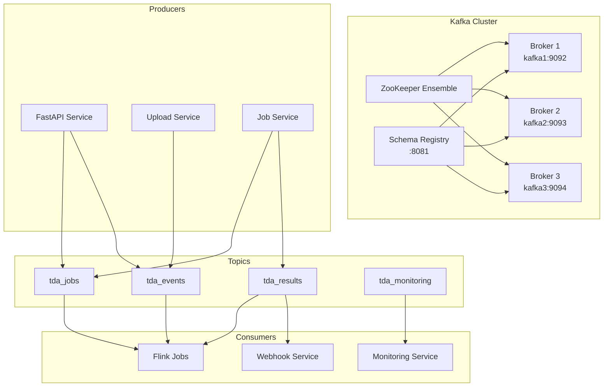

# Kafka Integration Architecture

The TDA Platform uses Apache Kafka as the backbone of its event-driven architecture, enabling real-time data processing, service decoupling, and scalable message distribution.

## 🏗️ Kafka Architecture Overview

### **Cluster Topology**



### **Topic Design Strategy**

| Topic | Partitions | Replication | Retention | Purpose |
|-------|------------|-------------|-----------|---------|
| `tda_jobs` | 6 | 3 | 7 days | Job lifecycle events |
| `tda_results` | 3 | 3 | 30 days | Computation results |
| `tda_events` | 12 | 3 | 24 hours | Real-time data events |
| `tda_monitoring` | 3 | 3 | 7 days | System metrics and health |

## 📋 Message Schemas

### **Job Lifecycle Messages**

```json
{
  "type": "object",
  "title": "TDA Job Message",
  "properties": {
    "metadata": {
      "type": "object",
      "properties": {
        "message_id": {"type": "string"},
        "message_type": {
          "type": "string",
          "enum": ["job.submitted", "job.started", "job.completed", "job.failed", "job.cancelled"]
        },
        "timestamp": {"type": "string", "format": "date-time"},
        "source_service": {"type": "string"},
        "correlation_id": {"type": "string"},
        "user_id": {"type": "string"},
        "version": {"type": "string", "default": "1.0"}
      },
      "required": ["message_id", "message_type", "timestamp", "source_service"]
    },
    "payload": {
      "type": "object",
      "properties": {
        "job_id": {"type": "string"},
        "status": {
          "type": "string",
          "enum": ["submitted", "running", "completed", "failed", "cancelled"]
        },
        "algorithm": {"type": "string"},
        "priority": {"type": "string"},
        "execution_time": {"type": "number"},
        "result_id": {"type": "string"},
        "error_message": {"type": "string"},
        "error_type": {"type": "string"}
      },
      "required": ["job_id", "status"]
    }
  },
  "required": ["metadata", "payload"]
}
```

### **Result Messages**

```json
{
  "type": "object",
  "title": "TDA Result Message",
  "properties": {
    "metadata": {
      "type": "object",
      "properties": {
        "message_id": {"type": "string"},
        "message_type": {
          "type": "string",
          "enum": ["result.generated", "result.cached"]
        },
        "timestamp": {"type": "string", "format": "date-time"},
        "source_service": {"type": "string"},
        "correlation_id": {"type": "string"},
        "version": {"type": "string", "default": "1.0"}
      },
      "required": ["message_id", "message_type", "timestamp", "source_service"]
    },
    "payload": {
      "type": "object",
      "properties": {
        "job_id": {"type": "string"},
        "result_id": {"type": "string"},
        "result_type": {"type": "string"},
        "result_size": {"type": "number"},
        "storage_path": {"type": "string"},
        "generated_at": {"type": "string", "format": "date-time"},
        "metadata": {"type": "object"}
      },
      "required": ["job_id", "result_id", "result_type"]
    }
  },
  "required": ["metadata", "payload"]
}
```

### **Event Stream Messages**

```json
{
  "type": "object",
  "title": "TDA Event Message",
  "properties": {
    "metadata": {
      "type": "object",
      "properties": {
        "message_id": {"type": "string"},
        "message_type": {
          "type": "string",
          "enum": ["file.uploaded", "file.validated", "file.processed", "error.occurred", "warning.issued"]
        },
        "timestamp": {"type": "string", "format": "date-time"},
        "source_service": {"type": "string"},
        "version": {"type": "string", "default": "1.0"}
      },
      "required": ["message_id", "message_type", "timestamp", "source_service"]
    },
    "payload": {
      "type": "object",
      "properties": {
        "event_id": {"type": "string"},
        "event_type": {"type": "string"},
        "data": {"type": "object"},
        "context": {"type": "object"}
      },
      "required": ["event_id", "event_type", "data"]
    }
  },
  "required": ["metadata", "payload"]
}
```

## 🚀 Producer Implementation

### **Async Kafka Producer Service**

```python
# Core producer implementation
class KafkaProducerService:
    """Asynchronous Kafka Producer Service for TDA Backend."""
    
    def __init__(self, config: Optional[KafkaConfig] = None):
        self.config = config or KafkaConfig()
        self.producer: Optional[AIOKafkaProducer] = None
        self._is_started = False
        self._metrics = {
            "messages_sent": 0,
            "messages_failed": 0,
            "bytes_sent": 0,
            "send_duration_total": 0.0,
            "last_send_time": None,
            "errors_by_type": {}
        }
    
    async def start(self) -> None:
        """Start the Kafka producer."""
        self.producer = AIOKafkaProducer(
            bootstrap_servers=self.config.producer.bootstrap_servers,
            client_id=self.config.producer.client_id,
            value_serializer=self._serialize_message,
            key_serializer=lambda x: x.encode('utf-8') if x else None,
            acks=self.config.producer.acks,
            retries=self.config.producer.retries,
            retry_backoff_ms=self.config.producer.retry_backoff_ms,
            batch_size=self.config.producer.batch_size,
            linger_ms=self.config.producer.linger_ms,
            compression_type=self.config.producer.compression_type,
            enable_idempotence=self.config.producer.enable_idempotence,
        )
        await self.producer.start()
        self._is_started = True
    
    async def send_message(
        self,
        message: Union[Dict[str, Any], TDAMessage],
        topic: Optional[str] = None,
        key: Optional[str] = None,
        partition: Optional[int] = None,
        headers: Optional[Dict[str, bytes]] = None,
        timeout: Optional[float] = None
    ) -> bool:
        """Send a message to Kafka with comprehensive error handling."""
        # Implementation with metrics, retry logic, and monitoring
        pass
```

### **Message Types and Factories**

```python
# Job message factory
class JobMessage(TDAMessage):
    @classmethod
    def create(
        cls,
        job_id: str,
        status: str,
        message_type: MessageType,
        **kwargs
    ) -> 'JobMessage':
        metadata = MessageMetadata(
            message_id=f"job-{job_id}-{int(time.time() * 1000)}",
            message_type=message_type,
            timestamp=datetime.now(timezone.utc),
            source_service="tda-backend",
            correlation_id=job_id
        )
        
        payload = {
            "job_id": job_id,
            "status": status,
            **kwargs
        }
        
        return cls(metadata=metadata, payload=payload)

# Result message factory
class ResultMessage(TDAMessage):
    @classmethod
    def create(
        cls,
        job_id: str,
        result_id: str,
        result_type: str,
        message_type: MessageType,
        **kwargs
    ) -> 'ResultMessage':
        # Similar implementation for result messages
        pass
```

### **Producer Configuration**

```python
# Producer configuration with performance tuning
@dataclass
class KafkaProducerConfig:
    bootstrap_servers: str = "kafka1:9092,kafka2:9093,kafka3:9094"
    client_id: str = "tda-backend-producer"
    
    # Reliability settings
    acks: str = "all"  # Wait for all in-sync replicas
    retries: int = 2147483647  # Retry indefinitely
    retry_backoff_ms: int = 100
    request_timeout_ms: int = 30000
    delivery_timeout_ms: int = 120000
    
    # Performance settings
    batch_size: int = 65536  # 64KB
    linger_ms: int = 10  # Wait up to 10ms for batching
    buffer_memory: int = 33554432  # 32MB
    max_request_size: int = 1048576  # 1MB
    
    # Compression and reliability
    compression_type: str = "lz4"
    enable_idempotence: bool = True
    max_in_flight_requests_per_connection: int = 1
```

## 🔧 API Integration

### **Seamless Producer Integration**

```python
# Automatic Kafka notifications via decorators
@kafka_notify("job_submitted")
async def create_computation_job(job_data: JobCreate):
    """Create TDA computation job with automatic Kafka notification."""
    job = await job_service.create_job(job_data)
    return job  # Decorator automatically sends job.submitted event

# Manual integration with context
async def process_file_upload(file: UploadFile):
    """Process file upload with explicit Kafka integration."""
    kafka = get_kafka_integration()
    
    try:
        # Process upload
        file_info = await upload_service.process_file(file)
        
        # Send success notification
        await kafka.send_file_uploaded(
            file_id=file_info.file_id,
            filename=file_info.filename,
            file_size=file_info.size,
            content_type=file_info.content_type
        )
        
        return file_info
        
    except Exception as e:
        # Send error notification
        await kafka.send_error_occurred(
            error_type=type(e).__name__,
            error_message=str(e),
            context={"operation": "file_upload", "filename": file.filename}
        )
        raise
```

### **Background Message Processing**

```python
# Asynchronous background notifications
async def send_background_notification(
    notification_func: Callable,
    *args,
    **kwargs
):
    """Send Kafka notification without blocking API response."""
    try:
        await notification_func(*args, **kwargs)
    except Exception as e:
        logger.error(f"Failed to send background notification: {e}")

# Usage in API endpoints
async def complete_job(job_id: str):
    """Complete job and notify asynchronously."""
    job = await job_service.complete_job(job_id)
    
    # Non-blocking notification
    asyncio.create_task(
        send_background_notification(
            kafka.send_job_completed,
            job_id=job.job_id,
            result_id=job.result_id,
            execution_time=job.execution_time
        )
    )
    
    return job
```

## 📊 Schema Registry Integration

### **Schema Management**

```python
class SchemaRegistry:
    """Client for interacting with Confluent Schema Registry."""
    
    async def register_schema(
        self,
        subject: str,
        schema: Dict[str, Any],
        schema_type: SchemaFormat = SchemaFormat.JSON_SCHEMA
    ) -> int:
        """Register a new schema version."""
        response = await self.client.post(
            f"{self.base_url}/subjects/{subject}/versions",
            json={
                "schema": json.dumps(schema),
                "schemaType": schema_type.value
            }
        )
        response.raise_for_status()
        return response.json()["id"]
    
    async def check_compatibility(
        self,
        subject: str,
        schema: Dict[str, Any],
        version: str = "latest"
    ) -> bool:
        """Check if schema is compatible with existing version."""
        response = await self.client.post(
            f"{self.base_url}/compatibility/subjects/{subject}/versions/{version}",
            json={"schema": json.dumps(schema)}
        )
        return response.json().get("is_compatible", False)
```

### **Message Validation**

```python
class MessageValidator:
    """Validator for TDA Kafka messages using schemas."""
    
    async def validate_message(
        self,
        message: Union[TDAMessage, Dict[str, Any]],
        message_type: Optional[MessageType] = None
    ) -> bool:
        """Validate a message against its schema."""
        try:
            # Extract message type
            if message_type is None:
                message_type = self._extract_message_type(message)
            
            # Get schema class
            schema_class = self.schemas.get(message_type)
            if schema_class is None:
                logger.warning(f"No schema found for message type: {message_type}")
                return False
            
            # Validate using Pydantic
            if isinstance(message, TDAMessage):
                message_dict = message.dict()
            else:
                message_dict = message
            
            schema_class(**message_dict)
            return True
            
        except ValidationError as e:
            logger.error(f"Message validation failed: {e}")
            return False
```

### **Schema Evolution Strategy**

```python
# Schema evolution with backward compatibility
class SchemaEvolution:
    """Handles schema evolution and compatibility checks."""
    
    COMPATIBILITY_LEVELS = {
        "BACKWARD": "New schema can read data written by previous schema",
        "FORWARD": "Previous schema can read data written by new schema", 
        "FULL": "Both backward and forward compatible",
        "NONE": "No compatibility guarantees"
    }
    
    async def evolve_schema(
        self,
        subject: str,
        new_schema: Dict[str, Any],
        compatibility_level: str = "BACKWARD"
    ) -> bool:
        """Evolve schema with compatibility checking."""
        # Set compatibility level
        await self.schema_registry.set_compatibility(subject, compatibility_level)
        
        # Check compatibility
        is_compatible = await self.schema_registry.check_compatibility(
            subject, new_schema
        )
        
        if not is_compatible:
            raise SchemaCompatibilityError(
                f"New schema for {subject} is not {compatibility_level} compatible"
            )
        
        # Register new schema version
        schema_id = await self.schema_registry.register_schema(
            subject, new_schema
        )
        
        logger.info(f"Evolved schema for {subject} to version {schema_id}")
        return True
```

## 📈 Monitoring and Metrics

### **Comprehensive Metrics Collection**

```python
# Prometheus metrics for Kafka operations
KAFKA_MESSAGES_PRODUCED_TOTAL = Counter(
    'tda_kafka_messages_produced_total',
    'Total number of messages produced to Kafka',
    ['topic', 'message_type', 'status']
)

KAFKA_PRODUCER_LATENCY_SECONDS = Histogram(
    'tda_kafka_producer_latency_seconds',
    'Time taken to send messages to Kafka',
    ['topic', 'message_type'],
    buckets=[0.001, 0.005, 0.01, 0.025, 0.05, 0.1, 0.25, 0.5, 1.0, 2.5, 5.0]
)

KAFKA_CONNECTION_STATUS = Gauge(
    'tda_kafka_connection_status',
    'Status of Kafka connection (1=healthy, 0=unhealthy)',
    ['component']
)

# Business metrics
TDA_JOB_EVENTS_TOTAL = Counter(
    'tda_job_events_total',
    'Total number of TDA job events',
    ['event_type']
)

TDA_COMPUTATION_RESULTS_TOTAL = Counter(
    'tda_computation_results_total',
    'Total number of computation results',
    ['result_type']
)
```

### **Health Monitoring**

```python
class KafkaHealthChecker:
    """Health checker for Kafka integration."""
    
    async def check_health(self) -> Dict[str, Any]:
        """Comprehensive health check."""
        try:
            # Check producer health
            producer_health = await self.producer.health_check()
            
            # Check cluster metadata
            metadata = await self.producer.producer.client.fetch_metadata()
            
            # Check schema registry
            schema_health = await self._check_schema_registry()
            
            return {
                "kafka_cluster": {
                    "status": "healthy",
                    "broker_count": len(metadata.brokers),
                    "topic_count": len(metadata.topics),
                    "details": producer_health
                },
                "schema_registry": schema_health,
                "producer": {
                    "status": "healthy" if producer_health["status"] == "healthy" else "unhealthy",
                    "metrics": self.producer.get_metrics()
                }
            }
            
        except Exception as e:
            return {
                "status": "unhealthy",
                "error": str(e),
                "timestamp": datetime.now(timezone.utc).isoformat()
            }
```

### **Alerting Rules**

```yaml
# Prometheus alerting rules for Kafka
groups:
  - name: kafka-alerts
    rules:
      - alert: KafkaProducerHighLatency
        expr: tda_kafka_producer_latency_seconds_p95 > 0.5
        for: 5m
        labels:
          severity: warning
        annotations:
          summary: "High Kafka producer latency"
          description: "Kafka producer latency p95 is {{ $value }}s"
      
      - alert: KafkaProducerErrors
        expr: rate(tda_kafka_messages_produced_total{status="error"}[5m]) > 0.1
        for: 2m
        labels:
          severity: critical
        annotations:
          summary: "High Kafka producer error rate"
          description: "Error rate is {{ $value }} messages/sec"
      
      - alert: KafkaConnectionDown
        expr: tda_kafka_connection_status == 0
        for: 1m
        labels:
          severity: critical
        annotations:
          summary: "Kafka connection is down"
          description: "Cannot connect to Kafka cluster"
```

## 🔧 Configuration Management

### **Environment-Based Configuration**

```python
class KafkaConfig(BaseSettings):
    """Kafka configuration with environment variable support."""
    
    # Broker configuration
    bootstrap_servers: str = Field(
        default="localhost:9092",
        env="KAFKA_BOOTSTRAP_SERVERS"
    )
    
    # Topic configuration
    topic_prefix: str = Field(default="tda_", env="KAFKA_TOPIC_PREFIX")
    
    # Topics
    jobs_topic: str = Field(default="tda_jobs", env="KAFKA_JOBS_TOPIC")
    results_topic: str = Field(default="tda_results", env="KAFKA_RESULTS_TOPIC")
    events_topic: str = Field(default="tda_events", env="KAFKA_EVENTS_TOPIC")
    monitoring_topic: str = Field(default="tda_monitoring", env="KAFKA_MONITORING_TOPIC")
    
    # Schema Registry
    schema_registry_url: str = Field(
        default="http://localhost:8081",
        env="SCHEMA_REGISTRY_URL"
    )
    
    # Security (when enabled)
    security_protocol: str = Field(default="PLAINTEXT", env="KAFKA_SECURITY_PROTOCOL")
    sasl_mechanism: str = Field(default="PLAIN", env="KAFKA_SASL_MECHANISM")
    sasl_username: Optional[str] = Field(default=None, env="KAFKA_SASL_USERNAME")
    sasl_password: Optional[str] = Field(default=None, env="KAFKA_SASL_PASSWORD")
    
    # SSL configuration
    ssl_cafile: Optional[str] = Field(default=None, env="KAFKA_SSL_CAFILE")
    ssl_certfile: Optional[str] = Field(default=None, env="KAFKA_SSL_CERTFILE")
    ssl_keyfile: Optional[str] = Field(default=None, env="KAFKA_SSL_KEYFILE")
    
    class Config:
        env_file = ".env"
        case_sensitive = False
```

### **Topic Management**

```python
# Automated topic creation and configuration
class TopicManager:
    """Manages Kafka topic creation and configuration."""
    
    TOPIC_CONFIGS = {
        "tda_jobs": {
            "partitions": 6,
            "replication_factor": 3,
            "config": {
                "retention.ms": 604800000,  # 7 days
                "cleanup.policy": "delete",
                "compression.type": "lz4"
            }
        },
        "tda_results": {
            "partitions": 3,
            "replication_factor": 3,
            "config": {
                "retention.ms": 2592000000,  # 30 days
                "cleanup.policy": "delete",
                "compression.type": "lz4"
            }
        },
        "tda_events": {
            "partitions": 12,
            "replication_factor": 3,
            "config": {
                "retention.ms": 86400000,  # 24 hours
                "cleanup.policy": "delete",
                "compression.type": "lz4"
            }
        }
    }
    
    async def ensure_topics_exist(self):
        """Ensure all required topics exist with correct configuration."""
        for topic_name, config in self.TOPIC_CONFIGS.items():
            await self._create_topic_if_not_exists(topic_name, config)
```

## 🚀 Performance Optimization

### **Producer Performance Tuning**

```python
# High-throughput producer configuration
PERFORMANCE_CONFIG = {
    # Batching for throughput
    "batch_size": 65536,  # 64KB batches
    "linger_ms": 10,      # Wait up to 10ms for batching
    "buffer_memory": 67108864,  # 64MB buffer
    
    # Compression for network efficiency
    "compression_type": "lz4",  # Fast compression
    
    # Concurrency
    "max_in_flight_requests_per_connection": 5,
    
    # Reliability vs. performance trade-off
    "acks": "all",  # Wait for all replicas (reliability)
    "enable_idempotence": True,  # Exactly-once semantics
    
    # Retry configuration
    "retries": 2147483647,  # Retry indefinitely
    "retry_backoff_ms": 100,
    "delivery_timeout_ms": 120000,  # 2 minutes total timeout
}
```

### **Connection Pooling**

```python
# Shared producer instance with connection pooling
class KafkaConnectionPool:
    """Manages shared Kafka producer connections."""
    
    def __init__(self, max_connections: int = 10):
        self.max_connections = max_connections
        self._connections: Dict[str, AIOKafkaProducer] = {}
        self._connection_lock = asyncio.Lock()
    
    async def get_producer(self, config_hash: str) -> AIOKafkaProducer:
        """Get or create a producer connection."""
        async with self._connection_lock:
            if config_hash not in self._connections:
                if len(self._connections) >= self.max_connections:
                    # Remove oldest connection
                    oldest_key = next(iter(self._connections))
                    await self._connections[oldest_key].stop()
                    del self._connections[oldest_key]
                
                # Create new connection
                producer = await self._create_producer(config_hash)
                self._connections[config_hash] = producer
            
            return self._connections[config_hash]
```

## 🔒 Security Considerations

### **SASL/SSL Configuration**

```python
# Production security configuration
SECURITY_CONFIG = {
    "security_protocol": "SASL_SSL",
    "sasl_mechanism": "PLAIN",
    "sasl_username": os.getenv("KAFKA_SASL_USERNAME"),
    "sasl_password": os.getenv("KAFKA_SASL_PASSWORD"),
    "ssl_cafile": "/etc/ssl/certs/ca-certificates.crt",
    "ssl_check_hostname": True,
}

# Message encryption (application-level)
class MessageEncryption:
    """Optional message-level encryption for sensitive data."""
    
    def __init__(self, key: bytes):
        self.fernet = Fernet(key)
    
    def encrypt_message(self, message: Dict[str, Any]) -> Dict[str, Any]:
        """Encrypt sensitive fields in message payload."""
        if "sensitive_data" in message.get("payload", {}):
            encrypted_data = self.fernet.encrypt(
                json.dumps(message["payload"]["sensitive_data"]).encode()
            )
            message["payload"]["sensitive_data"] = encrypted_data.decode()
            message["metadata"]["encrypted"] = True
        
        return message
```

---

*Next: [Flink Stream Processing](../flink/jobs.md) | [Monitoring Guide](../monitoring/prometheus.md)*