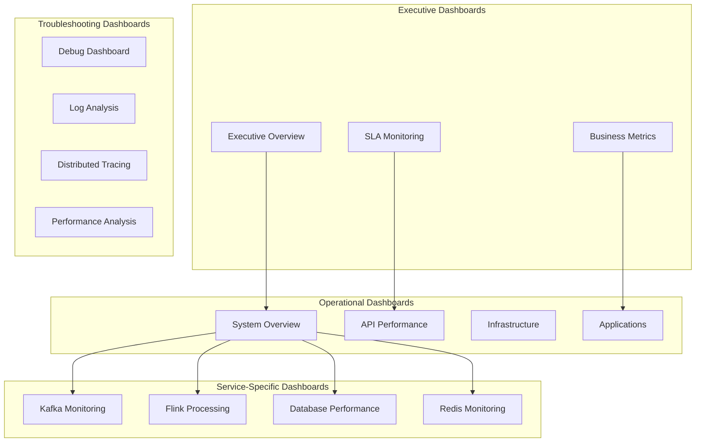

# Grafana Dashboards Configuration

Comprehensive Grafana dashboard setup for visualizing TDA Platform Backend metrics with pre-built dashboards, alerting, and performance monitoring.

## 📊 Dashboard Architecture

### **Dashboard Organization**



### **Dashboard Hierarchy**

| Level | Dashboard | Audience | Update Frequency |
|-------|-----------|----------|------------------|
| **L1** | Executive Overview | C-level, Management | Daily |
| **L2** | System Overview | Operations, DevOps | Real-time |
| **L3** | Service-Specific | Development Teams | Real-time |
| **L4** | Debug/Troubleshooting | Engineering | Real-time |

## ⚙️ Grafana Configuration

### **Data Source Configuration**

```yaml
# /deployment/monitoring/grafana/datasources/prometheus.yml
apiVersion: 1

datasources:
  - name: Prometheus
    type: prometheus
    access: proxy
    url: http://prometheus:9090
    isDefault: true
    editable: true
    jsonData:
      httpMethod: POST
      queryTimeout: 60s
      timeInterval: 15s
    secureJsonData:
      httpHeaderValue1: 'Bearer ${PROMETHEUS_API_TOKEN}'

  - name: Prometheus-Alerts
    type: prometheus
    access: proxy
    url: http://prometheus:9090
    editable: false
    jsonData:
      httpMethod: POST
      queryTimeout: 30s
      manageAlerts: true
    secureJsonData:
      httpHeaderValue1: 'Bearer ${PROMETHEUS_API_TOKEN}'

  - name: Loki
    type: loki
    access: proxy
    url: http://loki:3100
    editable: true
    jsonData:
      maxLines: 1000
      derivedFields:
        - datasourceUid: 'jaeger'
          matcherRegex: 'trace_id=(\w+)'
          name: 'TraceID'
          url: '$${__value.raw}'

  - name: Jaeger
    type: jaeger
    access: proxy
    url: http://jaeger:16686
    editable: true
    uid: jaeger
```

### **Dashboard Provisioning**

```yaml
# /deployment/monitoring/grafana/dashboards/dashboard-config.yml
apiVersion: 1

providers:
  - name: 'TDA Platform Dashboards'
    orgId: 1
    folder: 'TDA Platform'
    type: file
    disableDeletion: false
    updateIntervalSeconds: 10
    allowUiUpdates: true
    options:
      path: /etc/grafana/provisioning/dashboards/tda-platform

  - name: 'Infrastructure Dashboards'
    orgId: 1
    folder: 'Infrastructure'
    type: file
    disableDeletion: false
    updateIntervalSeconds: 10
    allowUiUpdates: true
    options:
      path: /etc/grafana/provisioning/dashboards/infrastructure

  - name: 'Troubleshooting Dashboards'
    orgId: 1
    folder: 'Troubleshooting'
    type: file
    disableDeletion: false
    updateIntervalSeconds: 10
    allowUiUpdates: true
    options:
      path: /etc/grafana/provisioning/dashboards/troubleshooting
```

## 📊 Executive Overview Dashboard

### **High-Level Business Metrics**

```json
{
  "dashboard": {
    "id": null,
    "title": "TDA Platform - Executive Overview",
    "tags": ["tda-platform", "executive", "overview"],
    "style": "dark",
    "timezone": "browser",
    "refresh": "5m",
    "time": {
      "from": "now-24h",
      "to": "now"
    },
    "panels": [
      {
        "id": 1,
        "title": "System Health Score",
        "type": "stat",
        "targets": [
          {
            "expr": "(\n  (avg(up{job=\"tda-api\"}) * 0.3) +\n  (avg(up{job=\"kafka\"}) * 0.2) +\n  (avg(up{job=\"postgres\"}) * 0.2) +\n  (avg(up{job=\"redis\"}) * 0.1) +\n  (avg(up{job=\"flink\"}) * 0.2)\n) * 100",
            "legendFormat": "Health Score",
            "refId": "A"
          }
        ],
        "fieldConfig": {
          "defaults": {
            "unit": "percent",
            "min": 0,
            "max": 100,
            "thresholds": {
              "steps": [
                {"color": "red", "value": 0},
                {"color": "yellow", "value": 80},
                {"color": "green", "value": 95}
              ]
            }
          }
        },
        "options": {
          "colorMode": "background",
          "graphMode": "none",
          "justifyMode": "center"
        },
        "gridPos": {"h": 8, "w": 6, "x": 0, "y": 0}
      },
      {
        "id": 2,
        "title": "Daily API Requests",
        "type": "stat",
        "targets": [
          {
            "expr": "increase(tda_api_requests_total[24h])",
            "legendFormat": "Total Requests",
            "refId": "A"
          }
        ],
        "fieldConfig": {
          "defaults": {
            "unit": "short",
            "color": {"mode": "thresholds"},
            "thresholds": {
              "steps": [
                {"color": "green", "value": 0},
                {"color": "yellow", "value": 50000},
                {"color": "red", "value": 100000}
              ]
            }
          }
        },
        "gridPos": {"h": 8, "w": 6, "x": 6, "y": 0}
      },
      {
        "id": 3,
        "title": "TDA Computations Completed",
        "type": "stat",
        "targets": [
          {
            "expr": "increase(tda_computation_total[24h])",
            "legendFormat": "Computations",
            "refId": "A"
          }
        ],
        "fieldConfig": {
          "defaults": {
            "unit": "short",
            "color": {"mode": "thresholds"},
            "thresholds": {
              "steps": [
                {"color": "green", "value": 0},
                {"color": "yellow", "value": 1000},
                {"color": "red", "value": 5000}
              ]
            }
          }
        },
        "gridPos": {"h": 8, "w": 6, "x": 12, "y": 0}
      },
      {
        "id": 4,
        "title": "Average Response Time",
        "type": "stat",
        "targets": [
          {
            "expr": "tda_api:latency_p95",
            "legendFormat": "95th Percentile",
            "refId": "A"
          }
        ],
        "fieldConfig": {
          "defaults": {
            "unit": "s",
            "color": {"mode": "thresholds"},
            "thresholds": {
              "steps": [
                {"color": "green", "value": 0},
                {"color": "yellow", "value": 1},
                {"color": "red", "value": 5}
              ]
            }
          }
        },
        "gridPos": {"h": 8, "w": 6, "x": 18, "y": 0}
      },
      {
        "id": 5,
        "title": "Error Rate Trend",
        "type": "timeseries",
        "targets": [
          {
            "expr": "tda_api:error_rate_5m",
            "legendFormat": "API Error Rate",
            "refId": "A"
          },
          {
            "expr": "tda_computation:error_rate_5m",
            "legendFormat": "Computation Error Rate",
            "refId": "B"
          }
        ],
        "fieldConfig": {
          "defaults": {
            "unit": "percentunit",
            "color": {"mode": "palette-classic"},
            "custom": {
              "drawStyle": "line",
              "fillOpacity": 20,
              "pointSize": 5
            }
          }
        },
        "gridPos": {"h": 8, "w": 12, "x": 0, "y": 8}
      },
      {
        "id": 6,
        "title": "Resource Utilization",
        "type": "timeseries",
        "targets": [
          {
            "expr": "avg(rate(container_cpu_usage_seconds_total[5m])) * 100",
            "legendFormat": "CPU Usage %",
            "refId": "A"
          },
          {
            "expr": "avg(container_memory_usage_bytes / container_spec_memory_limit_bytes) * 100",
            "legendFormat": "Memory Usage %",
            "refId": "B"
          }
        ],
        "fieldConfig": {
          "defaults": {
            "unit": "percent",
            "min": 0,
            "max": 100,
            "color": {"mode": "palette-classic"}
          }
        },
        "gridPos": {"h": 8, "w": 12, "x": 12, "y": 8}
      }
    ]
  }
}
```

## 🔧 API Performance Dashboard

### **Detailed API Monitoring**

```json
{
  "dashboard": {
    "id": null,
    "title": "TDA Platform - API Performance",
    "tags": ["tda-platform", "api", "performance"],
    "style": "dark",
    "timezone": "browser",
    "refresh": "10s",
    "time": {
      "from": "now-1h",
      "to": "now"
    },
    "panels": [
      {
        "id": 1,
        "title": "Request Rate by Endpoint",
        "type": "timeseries",
        "targets": [
          {
            "expr": "sum(rate(tda_api_requests_total[5m])) by (endpoint)",
            "legendFormat": "{{endpoint}}",
            "refId": "A"
          }
        ],
        "fieldConfig": {
          "defaults": {
            "unit": "reqps",
            "color": {"mode": "palette-classic"},
            "custom": {
              "drawStyle": "line",
              "fillOpacity": 10,
              "pointSize": 5
            }
          }
        },
        "gridPos": {"h": 8, "w": 12, "x": 0, "y": 0}
      },
      {
        "id": 2,
        "title": "Response Time Percentiles",
        "type": "timeseries",
        "targets": [
          {
            "expr": "histogram_quantile(0.50, sum(rate(tda_api_request_duration_seconds_bucket[5m])) by (le))",
            "legendFormat": "50th percentile",
            "refId": "A"
          },
          {
            "expr": "histogram_quantile(0.95, sum(rate(tda_api_request_duration_seconds_bucket[5m])) by (le))",
            "legendFormat": "95th percentile",
            "refId": "B"
          },
          {
            "expr": "histogram_quantile(0.99, sum(rate(tda_api_request_duration_seconds_bucket[5m])) by (le))",
            "legendFormat": "99th percentile",
            "refId": "C"
          }
        ],
        "fieldConfig": {
          "defaults": {
            "unit": "s",
            "color": {"mode": "palette-classic"}
          }
        },
        "gridPos": {"h": 8, "w": 12, "x": 12, "y": 0}
      },
      {
        "id": 3,
        "title": "Error Rate by Status Code",
        "type": "timeseries",
        "targets": [
          {
            "expr": "sum(rate(tda_api_requests_total{status=~\"4..\"}[5m])) by (status)",
            "legendFormat": "4xx - {{status}}",
            "refId": "A"
          },
          {
            "expr": "sum(rate(tda_api_requests_total{status=~\"5..\"}[5m])) by (status)",
            "legendFormat": "5xx - {{status}}",
            "refId": "B"
          }
        ],
        "fieldConfig": {
          "defaults": {
            "unit": "reqps",
            "color": {"mode": "palette-classic"}
          }
        },
        "gridPos": {"h": 8, "w": 12, "x": 0, "y": 8}
      },
      {
        "id": 4,
        "title": "Top Endpoints by Volume",
        "type": "barchart",
        "targets": [
          {
            "expr": "topk(10, sum(rate(tda_api_requests_total[5m])) by (endpoint))",
            "legendFormat": "{{endpoint}}",
            "refId": "A"
          }
        ],
        "fieldConfig": {
          "defaults": {
            "unit": "reqps",
            "color": {"mode": "palette-classic"}
          }
        },
        "gridPos": {"h": 8, "w": 12, "x": 12, "y": 8}
      },
      {
        "id": 5,
        "title": "TDA Computation Performance",
        "type": "timeseries",
        "targets": [
          {
            "expr": "histogram_quantile(0.95, sum(rate(tda_computation_duration_seconds_bucket[5m])) by (algorithm, le))",
            "legendFormat": "{{algorithm}} - 95th percentile",
            "refId": "A"
          }
        ],
        "fieldConfig": {
          "defaults": {
            "unit": "s",
            "color": {"mode": "palette-classic"}
          }
        },
        "gridPos": {"h": 8, "w": 24, "x": 0, "y": 16}
      },
      {
        "id": 6,
        "title": "Active Connections",
        "type": "stat",
        "targets": [
          {
            "expr": "sum(tda_requests_in_progress)",
            "legendFormat": "Active Requests",
            "refId": "A"
          }
        ],
        "fieldConfig": {
          "defaults": {
            "unit": "short",
            "color": {"mode": "thresholds"},
            "thresholds": {
              "steps": [
                {"color": "green", "value": 0},
                {"color": "yellow", "value": 50},
                {"color": "red", "value": 100}
              ]
            }
          }
        },
        "gridPos": {"h": 4, "w": 6, "x": 0, "y": 24}
      },
      {
        "id": 7,
        "title": "Cache Hit Rate",
        "type": "stat",
        "targets": [
          {
            "expr": "rate(redis_keyspace_hits_total[5m]) / (rate(redis_keyspace_hits_total[5m]) + rate(redis_keyspace_misses_total[5m])) * 100",
            "legendFormat": "Hit Rate",
            "refId": "A"
          }
        ],
        "fieldConfig": {
          "defaults": {
            "unit": "percent",
            "color": {"mode": "thresholds"},
            "thresholds": {
              "steps": [
                {"color": "red", "value": 0},
                {"color": "yellow", "value": 70},
                {"color": "green", "value": 90}
              ]
            }
          }
        },
        "gridPos": {"h": 4, "w": 6, "x": 6, "y": 24}
      }
    ]
  }
}
```

## 🏗️ Infrastructure Dashboard

### **System and Service Monitoring**

```json
{
  "dashboard": {
    "id": null,
    "title": "TDA Platform - Infrastructure",
    "tags": ["tda-platform", "infrastructure", "system"],
    "style": "dark",
    "timezone": "browser",
    "refresh": "30s",
    "time": {
      "from": "now-2h",
      "to": "now"
    },
    "panels": [
      {
        "id": 1,
        "title": "Service Availability",
        "type": "stat",
        "targets": [
          {
            "expr": "avg(up{job=\"tda-api\"})",
            "legendFormat": "API",
            "refId": "A"
          },
          {
            "expr": "avg(up{job=\"kafka\"})",
            "legendFormat": "Kafka",
            "refId": "B"
          },
          {
            "expr": "avg(up{job=\"postgres\"})",
            "legendFormat": "PostgreSQL",
            "refId": "C"
          },
          {
            "expr": "avg(up{job=\"redis\"})",
            "legendFormat": "Redis",
            "refId": "D"
          },
          {
            "expr": "avg(up{job=\"flink\"})",
            "legendFormat": "Flink",
            "refId": "E"
          }
        ],
        "fieldConfig": {
          "defaults": {
            "unit": "percentunit",
            "color": {"mode": "thresholds"},
            "thresholds": {
              "steps": [
                {"color": "red", "value": 0},
                {"color": "yellow", "value": 0.95},
                {"color": "green", "value": 0.99}
              ]
            }
          }
        },
        "gridPos": {"h": 8, "w": 24, "x": 0, "y": 0}
      },
      {
        "id": 2,
        "title": "CPU Usage by Container",
        "type": "timeseries",
        "targets": [
          {
            "expr": "sum(rate(container_cpu_usage_seconds_total{container_label_com_docker_compose_service!=\"\"}[5m])) by (container_label_com_docker_compose_service) * 100",
            "legendFormat": "{{container_label_com_docker_compose_service}}",
            "refId": "A"
          }
        ],
        "fieldConfig": {
          "defaults": {
            "unit": "percent",
            "color": {"mode": "palette-classic"},
            "custom": {
              "drawStyle": "line",
              "fillOpacity": 20
            }
          }
        },
        "gridPos": {"h": 8, "w": 12, "x": 0, "y": 8}
      },
      {
        "id": 3,
        "title": "Memory Usage by Container",
        "type": "timeseries",
        "targets": [
          {
            "expr": "sum(container_memory_usage_bytes{container_label_com_docker_compose_service!=\"\"}) by (container_label_com_docker_compose_service) / 1024 / 1024 / 1024",
            "legendFormat": "{{container_label_com_docker_compose_service}}",
            "refId": "A"
          }
        ],
        "fieldConfig": {
          "defaults": {
            "unit": "decgbytes",
            "color": {"mode": "palette-classic"}
          }
        },
        "gridPos": {"h": 8, "w": 12, "x": 12, "y": 8}
      },
      {
        "id": 4,
        "title": "Disk Usage",
        "type": "timeseries",
        "targets": [
          {
            "expr": "(node_filesystem_size_bytes - node_filesystem_avail_bytes) / node_filesystem_size_bytes * 100",
            "legendFormat": "{{mountpoint}}",
            "refId": "A"
          }
        ],
        "fieldConfig": {
          "defaults": {
            "unit": "percent",
            "min": 0,
            "max": 100,
            "color": {"mode": "palette-classic"}
          }
        },
        "gridPos": {"h": 8, "w": 12, "x": 0, "y": 16}
      },
      {
        "id": 5,
        "title": "Network I/O",
        "type": "timeseries",
        "targets": [
          {
            "expr": "sum(rate(container_network_receive_bytes_total[5m])) by (name) / 1024 / 1024",
            "legendFormat": "{{name}} - Receive",
            "refId": "A"
          },
          {
            "expr": "sum(rate(container_network_transmit_bytes_total[5m])) by (name) / 1024 / 1024",
            "legendFormat": "{{name}} - Transmit",
            "refId": "B"
          }
        ],
        "fieldConfig": {
          "defaults": {
            "unit": "MBs",
            "color": {"mode": "palette-classic"}
          }
        },
        "gridPos": {"h": 8, "w": 12, "x": 12, "y": 16}
      }
    ]
  }
}
```

## 🌊 Kafka & Flink Dashboard

### **Stream Processing Monitoring**

```json
{
  "dashboard": {
    "id": null,
    "title": "TDA Platform - Kafka & Flink",
    "tags": ["tda-platform", "kafka", "flink", "streaming"],
    "style": "dark",
    "timezone": "browser",
    "refresh": "15s",
    "time": {
      "from": "now-30m",
      "to": "now"
    },
    "panels": [
      {
        "id": 1,
        "title": "Kafka Message Rate",
        "type": "timeseries",
        "targets": [
          {
            "expr": "sum(rate(kafka_producer_record_send_total[5m])) by (topic)",
            "legendFormat": "{{topic}} - Produced",
            "refId": "A"
          },
          {
            "expr": "sum(rate(kafka_consumer_records_consumed_total[5m])) by (topic)",
            "legendFormat": "{{topic}} - Consumed",
            "refId": "B"
          }
        ],
        "fieldConfig": {
          "defaults": {
            "unit": "msgs",
            "color": {"mode": "palette-classic"}
          }
        },
        "gridPos": {"h": 8, "w": 12, "x": 0, "y": 0}
      },
      {
        "id": 2,
        "title": "Kafka Consumer Lag",
        "type": "timeseries",
        "targets": [
          {
            "expr": "sum(kafka_consumer_lag_sum) by (topic, partition)",
            "legendFormat": "{{topic}}-{{partition}}",
            "refId": "A"
          }
        ],
        "fieldConfig": {
          "defaults": {
            "unit": "short",
            "color": {"mode": "palette-classic"}
          }
        },
        "gridPos": {"h": 8, "w": 12, "x": 12, "y": 0}
      },
      {
        "id": 3,
        "title": "Flink Job Status",
        "type": "stat",
        "targets": [
          {
            "expr": "flink_jobmanager_numRunningJobs",
            "legendFormat": "Running Jobs",
            "refId": "A"
          },
          {
            "expr": "flink_jobmanager_numRegisteredTaskManagers",
            "legendFormat": "Task Managers",
            "refId": "B"
          }
        ],
        "fieldConfig": {
          "defaults": {
            "unit": "short",
            "color": {"mode": "thresholds"},
            "thresholds": {
              "steps": [
                {"color": "red", "value": 0},
                {"color": "green", "value": 1}
              ]
            }
          }
        },
        "gridPos": {"h": 8, "w": 12, "x": 0, "y": 8}
      },
      {
        "id": 4,
        "title": "Flink Throughput",
        "type": "timeseries",
        "targets": [
          {
            "expr": "sum(rate(flink_taskmanager_job_task_numRecordsIn[5m])) by (job_name)",
            "legendFormat": "{{job_name}} - Records In",
            "refId": "A"
          },
          {
            "expr": "sum(rate(flink_taskmanager_job_task_numRecordsOut[5m])) by (job_name)",
            "legendFormat": "{{job_name}} - Records Out",
            "refId": "B"
          }
        ],
        "fieldConfig": {
          "defaults": {
            "unit": "rps",
            "color": {"mode": "palette-classic"}
          }
        },
        "gridPos": {"h": 8, "w": 12, "x": 12, "y": 8}
      },
      {
        "id": 5,
        "title": "TDA Stream Processing Latency",
        "type": "timeseries",
        "targets": [
          {
            "expr": "histogram_quantile(0.95, sum(rate(tda_kafka_producer_latency_seconds_bucket[5m])) by (le, topic))",
            "legendFormat": "{{topic}} - Producer Latency",
            "refId": "A"
          },
          {
            "expr": "histogram_quantile(0.95, sum(rate(flink_taskmanager_job_latency_histogram_bucket[5m])) by (le, job_name))",
            "legendFormat": "{{job_name}} - Processing Latency",
            "refId": "B"
          }
        ],
        "fieldConfig": {
          "defaults": {
            "unit": "s",
            "color": {"mode": "palette-classic"}
          }
        },
        "gridPos": {"h": 8, "w": 24, "x": 0, "y": 16}
      }
    ]
  }
}
```

## 📊 SLA Monitoring Dashboard

### **Service Level Agreement Tracking**

```json
{
  "dashboard": {
    "id": null,
    "title": "TDA Platform - SLA Monitoring",
    "tags": ["tda-platform", "sla", "slo", "monitoring"],
    "style": "dark",
    "timezone": "browser",
    "refresh": "1m",
    "time": {
      "from": "now-7d",
      "to": "now"
    },
    "panels": [
      {
        "id": 1,
        "title": "API Availability (SLO: 99.9%)",
        "type": "stat",
        "targets": [
          {
            "expr": "avg_over_time(up{job=\"tda-api\"}[7d]) * 100",
            "legendFormat": "7-day Availability",
            "refId": "A"
          }
        ],
        "fieldConfig": {
          "defaults": {
            "unit": "percent",
            "min": 99,
            "max": 100,
            "color": {"mode": "thresholds"},
            "thresholds": {
              "steps": [
                {"color": "red", "value": 99},
                {"color": "yellow", "value": 99.5},
                {"color": "green", "value": 99.9}
              ]
            }
          }
        },
        "gridPos": {"h": 8, "w": 6, "x": 0, "y": 0}
      },
      {
        "id": 2,
        "title": "API Response Time SLO (95% < 2s)",
        "type": "stat",
        "targets": [
          {
            "expr": "histogram_quantile(0.95, avg_over_time(tda_api_request_duration_seconds_bucket[7d]))",
            "legendFormat": "95th Percentile",
            "refId": "A"
          }
        ],
        "fieldConfig": {
          "defaults": {
            "unit": "s",
            "color": {"mode": "thresholds"},
            "thresholds": {
              "steps": [
                {"color": "green", "value": 0},
                {"color": "yellow", "value": 1.5},
                {"color": "red", "value": 2}
              ]
            }
          }
        },
        "gridPos": {"h": 8, "w": 6, "x": 6, "y": 0}
      },
      {
        "id": 3,
        "title": "Error Rate SLO (< 0.1%)",
        "type": "stat",
        "targets": [
          {
            "expr": "avg_over_time((rate(tda_api_requests_total{status=~\"5..\"}[5m]) / rate(tda_api_requests_total[5m]))[7d:5m]) * 100",
            "legendFormat": "7-day Error Rate",
            "refId": "A"
          }
        ],
        "fieldConfig": {
          "defaults": {
            "unit": "percent",
            "color": {"mode": "thresholds"},
            "thresholds": {
              "steps": [
                {"color": "green", "value": 0},
                {"color": "yellow", "value": 0.05},
                {"color": "red", "value": 0.1}
              ]
            }
          }
        },
        "gridPos": {"h": 8, "w": 6, "x": 12, "y": 0}
      },
      {
        "id": 4,
        "title": "TDA Computation SLO (95% < 30s)",
        "type": "stat",
        "targets": [
          {
            "expr": "histogram_quantile(0.95, avg_over_time(tda_computation_duration_seconds_bucket[7d]))",
            "legendFormat": "95th Percentile",
            "refId": "A"
          }
        ],
        "fieldConfig": {
          "defaults": {
            "unit": "s",
            "color": {"mode": "thresholds"},
            "thresholds": {
              "steps": [
                {"color": "green", "value": 0},
                {"color": "yellow", "value": 20},
                {"color": "red", "value": 30}
              ]
            }
          }
        },
        "gridPos": {"h": 8, "w": 6, "x": 18, "y": 0}
      },
      {
        "id": 5,
        "title": "SLA Compliance Trend",
        "type": "timeseries",
        "targets": [
          {
            "expr": "avg_over_time(up{job=\"tda-api\"}[1d]) * 100",
            "legendFormat": "Availability SLA",
            "refId": "A"
          },
          {
            "expr": "(1 - avg_over_time((rate(tda_api_requests_total{status=~\"5..\"}[5m]) / rate(tda_api_requests_total[5m]))[1d:5m])) * 100",
            "legendFormat": "Error Rate SLA",
            "refId": "B"
          }
        ],
        "fieldConfig": {
          "defaults": {
            "unit": "percent",
            "min": 99,
            "max": 100,
            "color": {"mode": "palette-classic"}
          }
        },
        "gridPos": {"h": 8, "w": 24, "x": 0, "y": 8}
      }
    ]
  }
}
```

## 🔧 Dashboard Management Scripts

### **Dashboard Deployment Script**

```bash
#!/bin/bash
# /deployment/scripts/deploy-dashboards.sh

set -e

GRAFANA_URL="http://grafana:3000"
GRAFANA_USER="admin"
GRAFANA_PASSWORD="${GRAFANA_ADMIN_PASSWORD}"
DASHBOARD_DIR="/deployment/monitoring/grafana/dashboards"

echo "🚀 Deploying Grafana dashboards..."

# Wait for Grafana to be ready
echo "⏳ Waiting for Grafana to be ready..."
until curl -s "${GRAFANA_URL}/api/health" > /dev/null; do
    echo "  Grafana not ready, waiting..."
    sleep 5
done

# Create API key for dashboard deployment
echo "🔑 Creating API key..."
API_KEY_RESPONSE=$(curl -s -X POST \
    -H "Content-Type: application/json" \
    -u "${GRAFANA_USER}:${GRAFANA_PASSWORD}" \
    -d '{"name":"dashboard-deploy","role":"Admin"}' \
    "${GRAFANA_URL}/api/auth/keys")

API_KEY=$(echo "$API_KEY_RESPONSE" | jq -r '.key')

if [ "$API_KEY" = "null" ]; then
    echo "❌ Failed to create API key"
    exit 1
fi

# Deploy dashboards
echo "📊 Deploying dashboards..."

for dashboard_file in "$DASHBOARD_DIR"/*.json; do
    if [ -f "$dashboard_file" ]; then
        dashboard_name=$(basename "$dashboard_file" .json)
        echo "  📋 Deploying: $dashboard_name"
        
        # Wrap dashboard JSON in required format
        dashboard_json=$(jq '.dashboard.id = null | {"dashboard": .dashboard, "overwrite": true}' "$dashboard_file")
        
        response=$(curl -s -X POST \
            -H "Authorization: Bearer $API_KEY" \
            -H "Content-Type: application/json" \
            -d "$dashboard_json" \
            "${GRAFANA_URL}/api/dashboards/db")
        
        if echo "$response" | jq -e '.status == "success"' > /dev/null; then
            echo "    ✅ Successfully deployed: $dashboard_name"
        else
            echo "    ❌ Failed to deploy: $dashboard_name"
            echo "    Error: $(echo "$response" | jq -r '.message // .error')"
        fi
    fi
done

# Clean up API key
echo "🧹 Cleaning up..."
curl -s -X DELETE \
    -H "Authorization: Bearer $API_KEY" \
    "${GRAFANA_URL}/api/auth/keys/$(echo "$API_KEY_RESPONSE" | jq -r '.id')"

echo "✅ Dashboard deployment completed!"
```

### **Dashboard Backup Script**

```bash
#!/bin/bash
# /deployment/scripts/backup-dashboards.sh

set -e

GRAFANA_URL="http://grafana:3000"
GRAFANA_TOKEN="${GRAFANA_API_TOKEN}"
BACKUP_DIR="/backups/grafana/$(date +%Y%m%d_%H%M%S)"
S3_BUCKET="${BACKUP_S3_BUCKET}"

mkdir -p "$BACKUP_DIR"

echo "💾 Backing up Grafana dashboards..."

# Get all dashboards
dashboards=$(curl -s -H "Authorization: Bearer $GRAFANA_TOKEN" \
    "${GRAFANA_URL}/api/search?type=dash-db" | jq -r '.[].uid')

for uid in $dashboards; do
    dashboard_json=$(curl -s -H "Authorization: Bearer $GRAFANA_TOKEN" \
        "${GRAFANA_URL}/api/dashboards/uid/$uid")
    
    title=$(echo "$dashboard_json" | jq -r '.dashboard.title' | sed 's/[^a-zA-Z0-9]/_/g')
    
    echo "$dashboard_json" > "$BACKUP_DIR/${title}_${uid}.json"
    echo "  ✅ Backed up: $title"
done

# Compress backup
tar -czf "$BACKUP_DIR.tar.gz" -C "$(dirname "$BACKUP_DIR")" "$(basename "$BACKUP_DIR")"
rm -rf "$BACKUP_DIR"

# Upload to S3 if configured
if [ ! -z "$S3_BUCKET" ]; then
    aws s3 cp "$BACKUP_DIR.tar.gz" "s3://$S3_BUCKET/grafana-backups/"
    echo "☁️ Backup uploaded to S3"
fi

echo "✅ Dashboard backup completed: $BACKUP_DIR.tar.gz"
```

## 📱 Alert Notifications

### **Grafana Alerting Configuration**

```yaml
# /deployment/monitoring/grafana/alerting/notification-policies.yml
apiVersion: 1

policies:
  - orgId: 1
    receiver: default-receiver
    group_by: ['grafana_folder', 'alertname']
    group_wait: 10s
    group_interval: 5m
    repeat_interval: 12h
    routes:
      - matchers:
          - severity = critical
        receiver: critical-alerts
        continue: true
        group_wait: 0s
        repeat_interval: 5m
      
      - matchers:
          - team = api
        receiver: api-team
        continue: true
      
      - matchers:
          - team = ops
        receiver: ops-team
        continue: true

contactPoints:
  - orgId: 1
    name: default-receiver
    receivers:
      - uid: default_slack
        type: slack
        settings:
          url: ${SLACK_WEBHOOK_URL}
          channel: '#alerts'
          title: 'Grafana Alert'
          text: '{{ range .Alerts }}{{ .Annotations.summary }}{{ end }}'

  - orgId: 1
    name: critical-alerts
    receivers:
      - uid: critical_pagerduty
        type: pagerduty
        settings:
          integrationKey: ${PAGERDUTY_INTEGRATION_KEY}
          severity: critical
          summary: '{{ range .Alerts }}{{ .Annotations.summary }}{{ end }}'

  - orgId: 1
    name: api-team
    receivers:
      - uid: api_slack
        type: slack
        settings:
          url: ${SLACK_API_WEBHOOK_URL}
          channel: '#api-alerts'
          title: 'API Alert - {{ .GroupLabels.severity }}'
```

---

*This completes the Grafana dashboards configuration. The setup provides comprehensive visualization of all system metrics with executive, operational, and troubleshooting views for complete observability of the TDA Platform Backend.*