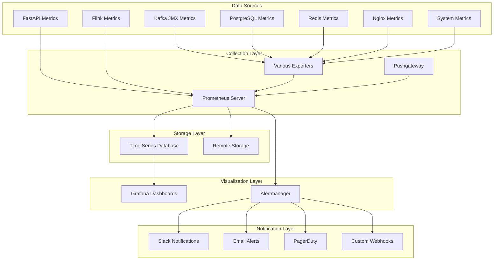

# Prometheus Monitoring Configuration

Comprehensive monitoring setup for the TDA Platform Backend using Prometheus, Grafana, and observability best practices for production-grade metrics collection and alerting.

## 📊 Monitoring Architecture Overview

### **Observability Stack**



### **Metrics Collection Strategy**

| Component | Metrics Type | Collection Method | Retention |
|-----------|--------------|-------------------|-----------|
| **FastAPI** | Application metrics | Prometheus client | 90 days |
| **Kafka** | JMX metrics | JMX Exporter | 30 days |
| **Flink** | Job metrics | Prometheus reporter | 30 days |
| **PostgreSQL** | Database metrics | Postgres Exporter | 90 days |
| **Redis** | Cache metrics | Redis Exporter | 30 days |
| **Nginx** | HTTP metrics | Nginx Exporter | 30 days |
| **System** | Infrastructure | Node Exporter | 90 days |

## ⚙️ Prometheus Configuration

### **Main Prometheus Configuration**

```yaml
# /deployment/monitoring/prometheus.yml
global:
  scrape_interval: 15s
  evaluation_interval: 15s
  external_labels:
    cluster: 'tda-platform-prod'
    environment: 'production'

# Alertmanager configuration
alerting:
  alertmanagers:
    - static_configs:
        - targets:
          - alertmanager:9093

# Rule files
rule_files:
  - "alert-rules.yml"
  - "recording-rules.yml"

# Scrape configurations
scrape_configs:
  # Prometheus self-monitoring
  - job_name: 'prometheus'
    static_configs:
      - targets: ['localhost:9090']
    scrape_interval: 30s
    metrics_path: '/metrics'

  # FastAPI application metrics
  - job_name: 'tda-api'
    static_configs:
      - targets: 
        - 'api-1:8000'
        - 'api-2:8000'
        - 'api-3:8000'
    metrics_path: '/metrics'
    scrape_interval: 15s
    scrape_timeout: 10s
    relabel_configs:
      - source_labels: [__address__]
        target_label: instance
      - source_labels: [__address__]
        regex: '([^:]+):.*'
        target_label: host
        replacement: '${1}'

  # PostgreSQL metrics
  - job_name: 'postgres'
    static_configs:
      - targets: ['postgres-exporter:9187']
    metrics_path: '/metrics'
    scrape_interval: 30s

  # Redis metrics
  - job_name: 'redis'
    static_configs:
      - targets: ['redis-exporter:9121']
    metrics_path: '/metrics'
    scrape_interval: 30s

  # Kafka metrics
  - job_name: 'kafka'
    static_configs:
      - targets: 
        - 'kafka-1:7071'
        - 'kafka-2:7072'
        - 'kafka-3:7073'
    metrics_path: '/metrics'
    scrape_interval: 30s

  # Kafka JMX metrics
  - job_name: 'kafka-jmx'
    static_configs:
      - targets:
        - 'kafka-jmx-exporter:5556'
    metrics_path: '/metrics'
    scrape_interval: 30s

  # Flink metrics
  - job_name: 'flink'
    static_configs:
      - targets: 
        - 'flink-jobmanager:9249'
        - 'flink-taskmanager-1:9249'
        - 'flink-taskmanager-2:9249'
    metrics_path: '/metrics'
    scrape_interval: 30s

  # Nginx metrics
  - job_name: 'nginx'
    static_configs:
      - targets: ['nginx-exporter:9113']
    metrics_path: '/metrics'
    scrape_interval: 30s

  # Node/system metrics
  - job_name: 'node'
    static_configs:
      - targets: ['node-exporter:9100']
    metrics_path: '/metrics'
    scrape_interval: 30s

  # Docker container metrics
  - job_name: 'cadvisor'
    static_configs:
      - targets: ['cadvisor:8080']
    metrics_path: '/metrics'
    scrape_interval: 30s

  # Blackbox monitoring (external endpoints)
  - job_name: 'blackbox'
    metrics_path: /probe
    params:
      module: [http_2xx]
    static_configs:
      - targets:
        - https://api.tda-platform.com/health
        - https://api.tda-platform.com/api/v1/health
    relabel_configs:
      - source_labels: [__address__]
        target_label: __param_target
      - source_labels: [__param_target]
        target_label: instance
      - target_label: __address__
        replacement: blackbox-exporter:9115

# Remote write configuration (for long-term storage)
remote_write:
  - url: "https://prometheus-remote-write.company.com/api/v1/write"
    basic_auth:
      username: "${REMOTE_WRITE_USERNAME}"
      password: "${REMOTE_WRITE_PASSWORD}"
    queue_config:
      max_samples_per_send: 1000
      max_shards: 200
      capacity: 2500

# Storage configuration
storage:
  tsdb:
    retention.time: 90d
    retention.size: 50GB
    wal-compression: true
```

### **Alerting Rules Configuration**

```yaml
# /deployment/monitoring/alert-rules.yml
groups:
  - name: tda-api-alerts
    rules:
      # High API response time
      - alert: TDAAPIHighLatency
        expr: histogram_quantile(0.95, tda_api_request_duration_seconds_bucket) > 2.0
        for: 5m
        labels:
          severity: warning
          service: tda-api
        annotations:
          summary: "TDA API high response time"
          description: "API 95th percentile latency is {{ $value }}s for {{ $labels.instance }}"
          runbook: "https://docs.company.com/runbooks/api-latency"

      # High API error rate
      - alert: TDAAPIHighErrorRate
        expr: rate(tda_api_requests_total{status=~"5.."}[5m]) / rate(tda_api_requests_total[5m]) > 0.05
        for: 2m
        labels:
          severity: critical
          service: tda-api
        annotations:
          summary: "TDA API high error rate"
          description: "API error rate is {{ $value | humanizePercentage }} for {{ $labels.instance }}"
          runbook: "https://docs.company.com/runbooks/api-errors"

      # API service down
      - alert: TDAAPIDown
        expr: up{job="tda-api"} == 0
        for: 1m
        labels:
          severity: critical
          service: tda-api
        annotations:
          summary: "TDA API service is down"
          description: "API instance {{ $labels.instance }} is down"
          runbook: "https://docs.company.com/runbooks/service-down"

      # High CPU usage
      - alert: TDAAPIHighCPU
        expr: rate(container_cpu_usage_seconds_total{container_label_com_docker_compose_service="api"}[5m]) > 0.8
        for: 10m
        labels:
          severity: warning
          service: tda-api
        annotations:
          summary: "TDA API high CPU usage"
          description: "API container CPU usage is {{ $value | humanizePercentage }} for {{ $labels.instance }}"

      # High memory usage
      - alert: TDAAPIHighMemory
        expr: container_memory_usage_bytes{container_label_com_docker_compose_service="api"} / container_spec_memory_limit_bytes > 0.85
        for: 10m
        labels:
          severity: warning
          service: tda-api
        annotations:
          summary: "TDA API high memory usage"
          description: "API container memory usage is {{ $value | humanizePercentage }} for {{ $labels.instance }}"

  - name: kafka-alerts
    rules:
      # Kafka broker down
      - alert: KafkaBrokerDown
        expr: up{job="kafka"} == 0
        for: 1m
        labels:
          severity: critical
          service: kafka
        annotations:
          summary: "Kafka broker is down"
          description: "Kafka broker {{ $labels.instance }} is down"

      # High Kafka consumer lag
      - alert: KafkaHighConsumerLag
        expr: kafka_consumer_lag_sum > 10000
        for: 5m
        labels:
          severity: warning
          service: kafka
        annotations:
          summary: "Kafka high consumer lag"
          description: "Consumer lag is {{ $value }} for topic {{ $labels.topic }}"

      # Kafka disk space low
      - alert: KafkaDiskSpaceLow
        expr: (kafka_log_size - kafka_log_start_offset) / (1024*1024*1024) > 80
        for: 10m
        labels:
          severity: warning
          service: kafka
        annotations:
          summary: "Kafka disk space low"
          description: "Kafka log size is {{ $value }}GB for {{ $labels.topic }}"

  - name: flink-alerts
    rules:
      # Flink job down
      - alert: FlinkJobDown
        expr: flink_jobmanager_numRunningJobs == 0
        for: 2m
        labels:
          severity: critical
          service: flink
        annotations:
          summary: "Flink job is down"
          description: "No Flink jobs are running"

      # High Flink job restart rate
      - alert: FlinkHighRestartRate
        expr: rate(flink_jobmanager_job_numRestarts[10m]) > 0.1
        for: 5m
        labels:
          severity: warning
          service: flink
        annotations:
          summary: "Flink job high restart rate"
          description: "Flink job restart rate is {{ $value }} for job {{ $labels.job_name }}"

      # Flink checkpoint failure
      - alert: FlinkCheckpointFailure
        expr: increase(flink_jobmanager_job_numberOfFailedCheckpoints[5m]) > 0
        for: 1m
        labels:
          severity: warning
          service: flink
        annotations:
          summary: "Flink checkpoint failure"
          description: "Flink checkpoint failed for job {{ $labels.job_name }}"

  - name: database-alerts
    rules:
      # PostgreSQL down
      - alert: PostgreSQLDown
        expr: up{job="postgres"} == 0
        for: 1m
        labels:
          severity: critical
          service: postgresql
        annotations:
          summary: "PostgreSQL is down"
          description: "PostgreSQL instance {{ $labels.instance }} is down"

      # High database connections
      - alert: PostgreSQLHighConnections
        expr: pg_stat_database_numbackends / pg_settings_max_connections > 0.8
        for: 5m
        labels:
          severity: warning
          service: postgresql
        annotations:
          summary: "PostgreSQL high connection usage"
          description: "Database connection usage is {{ $value | humanizePercentage }}"

      # Long running queries
      - alert: PostgreSQLLongRunningQuery
        expr: max(pg_stat_activity_max_tx_duration) > 300
        for: 2m
        labels:
          severity: warning
          service: postgresql
        annotations:
          summary: "PostgreSQL long running query"
          description: "Query running for {{ $value }}s in database {{ $labels.datname }}"

      # Database replication lag
      - alert: PostgreSQLReplicationLag
        expr: pg_stat_replication_replay_lag > 10
        for: 5m
        labels:
          severity: warning
          service: postgresql
        annotations:
          summary: "PostgreSQL replication lag"
          description: "Replication lag is {{ $value }}s for replica {{ $labels.client_addr }}"

  - name: redis-alerts
    rules:
      # Redis down
      - alert: RedisDown
        expr: up{job="redis"} == 0
        for: 1m
        labels:
          severity: critical
          service: redis
        annotations:
          summary: "Redis is down"
          description: "Redis instance {{ $labels.instance }} is down"

      # High Redis memory usage
      - alert: RedisHighMemoryUsage
        expr: redis_memory_used_bytes / redis_memory_max_bytes > 0.85
        for: 5m
        labels:
          severity: warning
          service: redis
        annotations:
          summary: "Redis high memory usage"
          description: "Redis memory usage is {{ $value | humanizePercentage }}"

      # Redis key expiration rate high
      - alert: RedisHighKeyExpiration
        expr: rate(redis_expired_keys_total[5m]) > 1000
        for: 5m
        labels:
          severity: warning
          service: redis
        annotations:
          summary: "Redis high key expiration rate"
          description: "Redis key expiration rate is {{ $value }} keys/sec"

  - name: system-alerts
    rules:
      # High system load
      - alert: SystemHighLoad
        expr: node_load15 > 2.0
        for: 10m
        labels:
          severity: warning
          service: system
        annotations:
          summary: "System high load average"
          description: "System load average is {{ $value }} on {{ $labels.instance }}"

      # Low disk space
      - alert: SystemLowDiskSpace
        expr: (node_filesystem_avail_bytes / node_filesystem_size_bytes) < 0.1
        for: 5m
        labels:
          severity: critical
          service: system
        annotations:
          summary: "System low disk space"
          description: "Disk space is {{ $value | humanizePercentage }} on {{ $labels.instance }}:{{ $labels.mountpoint }}"

      # High memory usage
      - alert: SystemHighMemoryUsage
        expr: (1 - (node_memory_MemAvailable_bytes / node_memory_MemTotal_bytes)) > 0.85
        for: 10m
        labels:
          severity: warning
          service: system
        annotations:
          summary: "System high memory usage"
          description: "Memory usage is {{ $value | humanizePercentage }} on {{ $labels.instance }}"
```

### **Recording Rules for Performance**

```yaml
# /deployment/monitoring/recording-rules.yml
groups:
  - name: tda-api-recording-rules
    interval: 30s
    rules:
      # API request rate by endpoint
      - record: tda_api:request_rate_5m
        expr: rate(tda_api_requests_total[5m])

      # API error rate by endpoint
      - record: tda_api:error_rate_5m
        expr: rate(tda_api_requests_total{status=~"5.."}[5m])

      # API latency percentiles
      - record: tda_api:latency_p50
        expr: histogram_quantile(0.50, tda_api_request_duration_seconds_bucket)

      - record: tda_api:latency_p95
        expr: histogram_quantile(0.95, tda_api_request_duration_seconds_bucket)

      - record: tda_api:latency_p99
        expr: histogram_quantile(0.99, tda_api_request_duration_seconds_bucket)

      # TDA computation metrics
      - record: tda_computation:duration_p95
        expr: histogram_quantile(0.95, tda_computation_duration_seconds_bucket)

      - record: tda_computation:rate_5m
        expr: rate(tda_computation_total[5m])

      - record: tda_computation:error_rate_5m
        expr: rate(tda_computation_errors_total[5m])

  - name: kafka-recording-rules
    interval: 30s
    rules:
      # Kafka message rates
      - record: kafka:message_rate_5m
        expr: rate(kafka_producer_record_send_total[5m])

      # Kafka consumer lag
      - record: kafka:consumer_lag
        expr: kafka_consumer_lag_sum

      # Kafka throughput
      - record: kafka:throughput_bytes_5m
        expr: rate(kafka_producer_byte_rate[5m])

  - name: flink-recording-rules
    interval: 30s
    rules:
      # Flink throughput
      - record: flink:records_per_second
        expr: rate(flink_taskmanager_job_task_numRecordsIn[5m])

      # Flink processing latency
      - record: flink:processing_latency_p95
        expr: histogram_quantile(0.95, flink_taskmanager_job_latency_histogram_bucket)

      # Flink checkpoint duration
      - record: flink:checkpoint_duration_p95
        expr: histogram_quantile(0.95, flink_jobmanager_job_lastCheckpointDuration_bucket)
```

## 📊 Custom Application Metrics

### **FastAPI Metrics Implementation**

```python
# /backend/monitoring/metrics.py
from prometheus_client import Counter, Histogram, Gauge, Info, generate_latest
from prometheus_client.core import CollectorRegistry
from typing import Dict, Any
import time
import psutil
import asyncio

# Create custom registry for TDA metrics
TDA_REGISTRY = CollectorRegistry()

# API Metrics
TDA_API_REQUESTS_TOTAL = Counter(
    'tda_api_requests_total',
    'Total number of API requests',
    ['method', 'endpoint', 'status'],
    registry=TDA_REGISTRY
)

TDA_API_REQUEST_DURATION = Histogram(
    'tda_api_request_duration_seconds',
    'API request duration',
    ['method', 'endpoint'],
    buckets=[0.01, 0.025, 0.05, 0.1, 0.25, 0.5, 1.0, 2.5, 5.0, 10.0],
    registry=TDA_REGISTRY
)

# TDA Computation Metrics
TDA_COMPUTATION_TOTAL = Counter(
    'tda_computation_total',
    'Total TDA computations',
    ['algorithm', 'dimension'],
    registry=TDA_REGISTRY
)

TDA_COMPUTATION_DURATION = Histogram(
    'tda_computation_duration_seconds',
    'TDA computation duration',
    ['algorithm', 'dimension'],
    buckets=[0.1, 0.5, 1.0, 2.0, 5.0, 10.0, 30.0, 60.0, 120.0, 300.0],
    registry=TDA_REGISTRY
)

TDA_COMPUTATION_ERRORS = Counter(
    'tda_computation_errors_total',
    'Total TDA computation errors',
    ['algorithm', 'error_type'],
    registry=TDA_REGISTRY
)

TDA_COMPUTATION_POINTS_PROCESSED = Histogram(
    'tda_computation_points_processed',
    'Number of points processed in TDA computation',
    ['algorithm'],
    buckets=[10, 50, 100, 500, 1000, 5000, 10000, 50000, 100000],
    registry=TDA_REGISTRY
)

# Business Metrics
TDA_ACTIVE_USERS = Gauge(
    'tda_active_users',
    'Number of active users',
    registry=TDA_REGISTRY
)

TDA_JOBS_QUEUED = Gauge(
    'tda_jobs_queued',
    'Number of jobs in queue',
    ['status'],
    registry=TDA_REGISTRY
)

TDA_DATA_UPLOADED_BYTES = Counter(
    'tda_data_uploaded_bytes_total',
    'Total bytes of data uploaded',
    ['file_type'],
    registry=TDA_REGISTRY
)

# Kafka Metrics
TDA_KAFKA_MESSAGES_PRODUCED = Counter(
    'tda_kafka_messages_produced_total',
    'Total Kafka messages produced',
    ['topic', 'status'],
    registry=TDA_REGISTRY
)

TDA_KAFKA_PRODUCER_LATENCY = Histogram(
    'tda_kafka_producer_latency_seconds',
    'Kafka producer latency',
    ['topic'],
    buckets=[0.001, 0.005, 0.01, 0.025, 0.05, 0.1, 0.25, 0.5, 1.0],
    registry=TDA_REGISTRY
)

# Application Info
TDA_APP_INFO = Info(
    'tda_app',
    'TDA application information',
    registry=TDA_REGISTRY
)

# System Resource Metrics
TDA_MEMORY_USAGE = Gauge(
    'tda_memory_usage_bytes',
    'Memory usage in bytes',
    ['type'],  # heap, non_heap, total
    registry=TDA_REGISTRY
)

TDA_CPU_USAGE = Gauge(
    'tda_cpu_usage_percent',
    'CPU usage percentage',
    registry=TDA_REGISTRY
)

class MetricsCollector:
    """Centralized metrics collection and management."""
    
    def __init__(self):
        self.start_time = time.time()
        self.request_in_progress = Gauge(
            'tda_requests_in_progress',
            'Requests currently being processed',
            registry=TDA_REGISTRY
        )
        
        # Set application info
        TDA_APP_INFO.info({
            'version': '1.0.0',
            'python_version': '3.11',
            'environment': 'production'
        })
    
    def record_request(self, method: str, endpoint: str, status: str, duration: float):
        """Record API request metrics."""
        TDA_API_REQUESTS_TOTAL.labels(
            method=method,
            endpoint=endpoint,
            status=status
        ).inc()
        
        TDA_API_REQUEST_DURATION.labels(
            method=method,
            endpoint=endpoint
        ).observe(duration)
    
    def record_computation(
        self,
        algorithm: str,
        dimension: int,
        duration: float,
        points_count: int,
        success: bool = True,
        error_type: str = None
    ):
        """Record TDA computation metrics."""
        TDA_COMPUTATION_TOTAL.labels(
            algorithm=algorithm,
            dimension=str(dimension)
        ).inc()
        
        TDA_COMPUTATION_DURATION.labels(
            algorithm=algorithm,
            dimension=str(dimension)
        ).observe(duration)
        
        TDA_COMPUTATION_POINTS_PROCESSED.labels(
            algorithm=algorithm
        ).observe(points_count)
        
        if not success and error_type:
            TDA_COMPUTATION_ERRORS.labels(
                algorithm=algorithm,
                error_type=error_type
            ).inc()
    
    def record_kafka_message(self, topic: str, success: bool, latency: float):
        """Record Kafka message metrics."""
        status = "success" if success else "error"
        TDA_KAFKA_MESSAGES_PRODUCED.labels(
            topic=topic,
            status=status
        ).inc()
        
        TDA_KAFKA_PRODUCER_LATENCY.labels(
            topic=topic
        ).observe(latency)
    
    def record_file_upload(self, file_type: str, size_bytes: int):
        """Record file upload metrics."""
        TDA_DATA_UPLOADED_BYTES.labels(
            file_type=file_type
        ).inc(size_bytes)
    
    def update_system_metrics(self):
        """Update system resource metrics."""
        process = psutil.Process()
        
        # Memory metrics
        memory_info = process.memory_info()
        TDA_MEMORY_USAGE.labels(type="rss").set(memory_info.rss)
        TDA_MEMORY_USAGE.labels(type="vms").set(memory_info.vms)
        
        # CPU metrics
        cpu_percent = process.cpu_percent()
        TDA_CPU_USAGE.set(cpu_percent)
    
    async def start_background_collection(self):
        """Start background metrics collection."""
        while True:
            try:
                self.update_system_metrics()
                await asyncio.sleep(30)  # Update every 30 seconds
            except Exception as e:
                print(f"Error updating system metrics: {e}")
                await asyncio.sleep(60)  # Wait longer on error

# Global metrics instance
metrics = MetricsCollector()

def get_metrics_content() -> str:
    """Get Prometheus metrics content."""
    return generate_latest(TDA_REGISTRY).decode('utf-8')

# Middleware for request metrics
class MetricsMiddleware:
    """FastAPI middleware for automatic metrics collection."""
    
    def __init__(self, app):
        self.app = app
    
    async def __call__(self, scope, receive, send):
        if scope["type"] != "http":
            await self.app(scope, receive, send)
            return
        
        # Extract request info
        method = scope["method"]
        path = scope["path"]
        endpoint = self._normalize_endpoint(path)
        
        # Track request start
        start_time = time.time()
        metrics.request_in_progress.inc()
        
        # Process request
        status_code = 200
        async def send_wrapper(message):
            nonlocal status_code
            if message["type"] == "http.response.start":
                status_code = message["status"]
            await send(message)
        
        try:
            await self.app(scope, receive, send_wrapper)
        finally:
            # Record metrics
            duration = time.time() - start_time
            metrics.record_request(
                method=method,
                endpoint=endpoint,
                status=str(status_code),
                duration=duration
            )
            metrics.request_in_progress.dec()
    
    def _normalize_endpoint(self, path: str) -> str:
        """Normalize endpoint path for metrics."""
        # Replace dynamic segments with placeholders
        import re
        
        # Common patterns to normalize
        patterns = [
            (r'/api/v\d+', '/api/v1'),
            (r'/jobs/[^/]+', '/jobs/{job_id}'),
            (r'/data/[^/]+', '/data/{file_id}'),
            (r'/users/[^/]+', '/users/{user_id}'),
        ]
        
        normalized = path
        for pattern, replacement in patterns:
            normalized = re.sub(pattern, replacement, normalized)
        
        return normalized
```

### **Integration with FastAPI**

```python
# /backend/main.py
from fastapi import FastAPI, Request, Response
from fastapi.responses import PlainTextResponse
from .monitoring.metrics import MetricsMiddleware, get_metrics_content, metrics
import asyncio

app = FastAPI(title="TDA Platform Backend")

# Add metrics middleware
app.add_middleware(MetricsMiddleware)

@app.on_event("startup")
async def startup_event():
    """Start background metrics collection."""
    asyncio.create_task(metrics.start_background_collection())

@app.get("/metrics", response_class=PlainTextResponse)
async def get_metrics():
    """Prometheus metrics endpoint."""
    return get_metrics_content()

@app.get("/health")
async def health_check():
    """Health check endpoint."""
    return {
        "status": "healthy",
        "timestamp": time.time(),
        "version": "1.0.0"
    }

# Example usage in computation endpoint
@app.post("/api/v1/tda/compute/vietoris-rips")
async def compute_vietoris_rips(request: ComputationRequest):
    start_time = time.time()
    
    try:
        # Perform computation
        result = await tda_service.compute_vietoris_rips(
            point_cloud=request.point_cloud.points,
            **request.parameters.dict()
        )
        
        # Record successful computation
        duration = time.time() - start_time
        metrics.record_computation(
            algorithm="vietoris_rips",
            dimension=request.point_cloud.dimension,
            duration=duration,
            points_count=len(request.point_cloud.points),
            success=True
        )
        
        return result
        
    except Exception as e:
        # Record failed computation
        duration = time.time() - start_time
        metrics.record_computation(
            algorithm="vietoris_rips",
            dimension=request.point_cloud.dimension,
            duration=duration,
            points_count=len(request.point_cloud.points),
            success=False,
            error_type=type(e).__name__
        )
        raise
```

## 🚨 Alertmanager Configuration

### **Alertmanager Configuration**

```yaml
# /deployment/monitoring/alertmanager.yml
global:
  smtp_smarthost: 'smtp.company.com:587'
  smtp_from: 'alerts@tda-platform.com'
  smtp_auth_username: 'alerts@tda-platform.com'
  smtp_auth_password: '${SMTP_PASSWORD}'

# Templates
templates:
  - '/etc/alertmanager/templates/*.tmpl'

# Routing rules
route:
  group_by: ['alertname', 'cluster', 'service']
  group_wait: 10s
  group_interval: 10s
  repeat_interval: 12h
  receiver: 'default'
  routes:
    # Critical alerts go to PagerDuty
    - match:
        severity: critical
      receiver: 'pagerduty'
      continue: true
    
    # API alerts go to development team
    - match:
        service: tda-api
      receiver: 'dev-team'
      continue: true
    
    # Infrastructure alerts go to ops team
    - match_re:
        service: ^(kafka|postgres|redis|flink)$
      receiver: 'ops-team'
      continue: true
    
    # Warning alerts during business hours
    - match:
        severity: warning
      receiver: 'business-hours'
      active_time_intervals:
        - business_hours

# Time intervals
time_intervals:
  - name: business_hours
    time_intervals:
      - times:
        - start_time: '09:00'
          end_time: '17:00'
        weekdays: ['monday:friday']
        location: 'America/New_York'

# Alert receivers
receivers:
  - name: 'default'
    slack_configs:
      - api_url: '${SLACK_WEBHOOK_URL}'
        channel: '#alerts'
        title: 'TDA Platform Alert'
        text: '{{ range .Alerts }}{{ .Annotations.summary }}{{ end }}'
        color: 'warning'

  - name: 'pagerduty'
    pagerduty_configs:
      - routing_key: '${PAGERDUTY_ROUTING_KEY}'
        description: '{{ range .Alerts }}{{ .Annotations.summary }}{{ end }}'
        severity: '{{ .GroupLabels.severity }}'

  - name: 'dev-team'
    slack_configs:
      - api_url: '${SLACK_DEV_WEBHOOK_URL}'
        channel: '#dev-alerts'
        title: 'API Alert - {{ .GroupLabels.severity }}'
        text: |
          {{ range .Alerts }}
          *Alert:* {{ .Annotations.summary }}
          *Description:* {{ .Annotations.description }}
          *Runbook:* {{ .Annotations.runbook }}
          {{ end }}
        color: '{{ if eq .Status "firing" }}danger{{ else }}good{{ end }}'
    
    email_configs:
      - to: 'dev-team@company.com'
        subject: 'TDA API Alert: {{ .GroupLabels.alertname }}'
        body: |
          {{ range .Alerts }}
          Alert: {{ .Annotations.summary }}
          Description: {{ .Annotations.description }}
          Runbook: {{ .Annotations.runbook }}
          {{ end }}

  - name: 'ops-team'
    slack_configs:
      - api_url: '${SLACK_OPS_WEBHOOK_URL}'
        channel: '#ops-alerts'
        title: 'Infrastructure Alert - {{ .GroupLabels.severity }}'
        text: |
          {{ range .Alerts }}
          *Service:* {{ .Labels.service }}
          *Alert:* {{ .Annotations.summary }}
          *Description:* {{ .Annotations.description }}
          {{ end }}
        color: '{{ if eq .Status "firing" }}danger{{ else }}good{{ end }}'

  - name: 'business-hours'
    slack_configs:
      - api_url: '${SLACK_WEBHOOK_URL}'
        channel: '#alerts-business-hours'
        title: 'Business Hours Alert'
        text: '{{ range .Alerts }}{{ .Annotations.summary }}{{ end }}'
        color: 'warning'

# Inhibition rules
inhibit_rules:
  # Inhibit warning alerts when critical alerts are firing for the same service
  - source_match:
      severity: 'critical'
    target_match:
      severity: 'warning'
    equal: ['service', 'instance']
```

### **Alert Templates**

```html
<!-- /deployment/monitoring/templates/slack.tmpl -->
{{ define "slack.title" }}
{{ range .Alerts }}{{ .Annotations.summary }}{{ end }}
{{ end }}

{{ define "slack.text" }}
{{ range .Alerts }}
*Alert:* {{ .Annotations.summary }}
*Severity:* {{ .Labels.severity }}
*Service:* {{ .Labels.service }}
*Instance:* {{ .Labels.instance }}
*Description:* {{ .Annotations.description }}
{{ if .Annotations.runbook }}*Runbook:* {{ .Annotations.runbook }}{{ end }}
*Time:* {{ .StartsAt.Format "2006-01-02 15:04:05 UTC" }}
{{ end }}
{{ end }}

{{ define "slack.color" }}
{{ if eq .Status "firing" }}
  {{ if eq .CommonLabels.severity "critical" }}danger{{ else }}warning{{ end }}
{{ else }}good{{ end }}
{{ end }}
```

---

*This completes the Prometheus monitoring configuration. The setup provides comprehensive metrics collection, alerting rules, and integration with external notification systems for production-ready observability.*