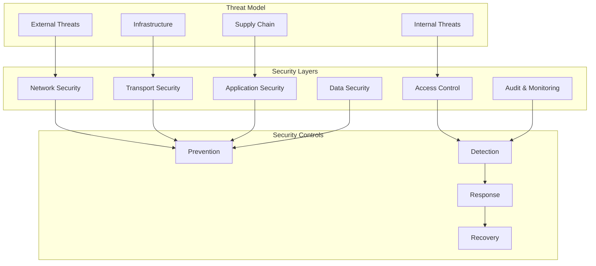

# Security Hardening Documentation

Comprehensive security hardening guide for the TDA Platform Backend including authentication, authorization, encryption, vulnerability management, and compliance frameworks.

## 🔒 Security Architecture Overview

### **Security Design Principles**



### **Security Framework Components**

| Layer | Security Control | Implementation | Priority |
|-------|------------------|----------------|----------|
| **Network** | Firewall, VPN, DDoS protection | Cloud WAF, Security Groups | Critical |
| **Transport** | TLS/SSL, Certificate Management | Let's Encrypt, HSTS | Critical |
| **Application** | Authentication, Authorization | JWT, RBAC, OAuth2 | Critical |
| **Data** | Encryption, Backup, Integrity | AES-256, Hash verification | Critical |
| **Infrastructure** | Container Security, Secrets | Docker security, Vault | High |
| **Monitoring** | SIEM, Intrusion Detection | ELK Stack, Alerts | High |

## 🔐 Authentication & Authorization

### **JWT-Based Authentication System**

```python
# /backend/security/auth.py
import jwt
import bcrypt
import secrets
from datetime import datetime, timedelta
from typing import Optional, Dict, Any, List
from fastapi import HTTPException, Depends, status
from fastapi.security import HTTPBearer, HTTPAuthorizationCredentials
from passlib.context import CryptContext
import redis
from enum import Enum

class UserRole(str, Enum):
    ADMIN = "admin"
    RESEARCHER = "researcher" 
    ANALYST = "analyst"
    VIEWER = "viewer"

class Permission(str, Enum):
    # TDA Computation permissions
    COMPUTE_VR = "compute:vietoris_rips"
    COMPUTE_CECH = "compute:cech"
    COMPUTE_ALPHA = "compute:alpha_complex"
    
    # Data management permissions
    DATA_UPLOAD = "data:upload"
    DATA_DELETE = "data:delete"
    DATA_EXPORT = "data:export"
    
    # System administration
    ADMIN_USERS = "admin:users"
    ADMIN_SYSTEM = "admin:system"
    ADMIN_METRICS = "admin:metrics"
    
    # Job management
    JOB_CREATE = "job:create"
    JOB_CANCEL = "job:cancel"
    JOB_VIEW_ALL = "job:view_all"

# Role-based permission mapping
ROLE_PERMISSIONS = {
    UserRole.ADMIN: [
        Permission.COMPUTE_VR,
        Permission.COMPUTE_CECH,
        Permission.COMPUTE_ALPHA,
        Permission.DATA_UPLOAD,
        Permission.DATA_DELETE,
        Permission.DATA_EXPORT,
        Permission.ADMIN_USERS,
        Permission.ADMIN_SYSTEM,
        Permission.ADMIN_METRICS,
        Permission.JOB_CREATE,
        Permission.JOB_CANCEL,
        Permission.JOB_VIEW_ALL,
    ],
    UserRole.RESEARCHER: [
        Permission.COMPUTE_VR,
        Permission.COMPUTE_CECH,
        Permission.COMPUTE_ALPHA,
        Permission.DATA_UPLOAD,
        Permission.DATA_EXPORT,
        Permission.JOB_CREATE,
        Permission.JOB_CANCEL,
    ],
    UserRole.ANALYST: [
        Permission.COMPUTE_VR,
        Permission.DATA_UPLOAD,
        Permission.DATA_EXPORT,
        Permission.JOB_CREATE,
    ],
    UserRole.VIEWER: [
        Permission.DATA_EXPORT,
    ]
}

class SecurityConfig:
    """Security configuration settings."""
    
    # JWT settings
    JWT_SECRET_KEY: str = secrets.token_urlsafe(32)
    JWT_ALGORITHM: str = "HS256"
    JWT_ACCESS_TOKEN_EXPIRE_MINUTES: int = 30
    JWT_REFRESH_TOKEN_EXPIRE_DAYS: int = 7
    
    # Password settings
    PASSWORD_MIN_LENGTH: int = 12
    PASSWORD_REQUIRE_UPPERCASE: bool = True
    PASSWORD_REQUIRE_LOWERCASE: bool = True
    PASSWORD_REQUIRE_NUMBERS: bool = True
    PASSWORD_REQUIRE_SPECIAL: bool = True
    
    # Session settings
    SESSION_TIMEOUT_MINUTES: int = 60
    MAX_LOGIN_ATTEMPTS: int = 5
    LOCKOUT_DURATION_MINUTES: int = 15
    
    # Rate limiting
    RATE_LIMIT_REQUESTS_PER_MINUTE: int = 100
    API_KEY_RATE_LIMIT: int = 1000

class PasswordValidator:
    """Password strength validation."""
    
    @staticmethod
    def validate_password(password: str) -> Dict[str, Any]:
        """Validate password strength and return requirements."""
        errors = []
        
        if len(password) < SecurityConfig.PASSWORD_MIN_LENGTH:
            errors.append(f"Password must be at least {SecurityConfig.PASSWORD_MIN_LENGTH} characters")
        
        if SecurityConfig.PASSWORD_REQUIRE_UPPERCASE and not any(c.isupper() for c in password):
            errors.append("Password must contain at least one uppercase letter")
        
        if SecurityConfig.PASSWORD_REQUIRE_LOWERCASE and not any(c.islower() for c in password):
            errors.append("Password must contain at least one lowercase letter")
        
        if SecurityConfig.PASSWORD_REQUIRE_NUMBERS and not any(c.isdigit() for c in password):
            errors.append("Password must contain at least one number")
        
        if SecurityConfig.PASSWORD_REQUIRE_SPECIAL and not any(c in "!@#$%^&*()_+-=[]{}|;:,.<>?" for c in password):
            errors.append("Password must contain at least one special character")
        
        # Check common patterns
        common_patterns = ["password", "123456", "qwerty", "admin"]
        if any(pattern in password.lower() for pattern in common_patterns):
            errors.append("Password contains common patterns")
        
        return {
            "valid": len(errors) == 0,
            "errors": errors,
            "strength": "strong" if len(errors) == 0 else "weak"
        }

class AuthenticationService:
    """Authentication service with enhanced security."""
    
    def __init__(self, redis_client: redis.Redis):
        self.redis = redis_client
        self.pwd_context = CryptContext(schemes=["bcrypt"], deprecated="auto")
        self.security = HTTPBearer()
    
    def hash_password(self, password: str) -> str:
        """Hash password with bcrypt."""
        return self.pwd_context.hash(password)
    
    def verify_password(self, plain_password: str, hashed_password: str) -> bool:
        """Verify password against hash."""
        return self.pwd_context.verify(plain_password, hashed_password)
    
    def create_access_token(self, user_id: str, role: UserRole, permissions: List[Permission]) -> str:
        """Create JWT access token."""
        expire = datetime.utcnow() + timedelta(minutes=SecurityConfig.JWT_ACCESS_TOKEN_EXPIRE_MINUTES)
        
        payload = {
            "sub": user_id,
            "role": role.value,
            "permissions": [p.value for p in permissions],
            "exp": expire,
            "iat": datetime.utcnow(),
            "type": "access"
        }
        
        return jwt.encode(payload, SecurityConfig.JWT_SECRET_KEY, algorithm=SecurityConfig.JWT_ALGORITHM)
    
    def create_refresh_token(self, user_id: str) -> str:
        """Create JWT refresh token."""
        expire = datetime.utcnow() + timedelta(days=SecurityConfig.JWT_REFRESH_TOKEN_EXPIRE_DAYS)
        
        payload = {
            "sub": user_id,
            "exp": expire,
            "iat": datetime.utcnow(),
            "type": "refresh"
        }
        
        token = jwt.encode(payload, SecurityConfig.JWT_SECRET_KEY, algorithm=SecurityConfig.JWT_ALGORITHM)
        
        # Store refresh token in Redis for revocation
        self.redis.setex(
            f"refresh_token:{user_id}:{token[-10:]}", 
            timedelta(days=SecurityConfig.JWT_REFRESH_TOKEN_EXPIRE_DAYS),
            "valid"
        )
        
        return token
    
    def verify_token(self, token: str) -> Dict[str, Any]:
        """Verify and decode JWT token."""
        try:
            payload = jwt.decode(
                token, 
                SecurityConfig.JWT_SECRET_KEY, 
                algorithms=[SecurityConfig.JWT_ALGORITHM]
            )
            
            # Check if refresh token is revoked
            if payload.get("type") == "refresh":
                token_key = f"refresh_token:{payload['sub']}:{token[-10:]}"
                if not self.redis.exists(token_key):
                    raise HTTPException(
                        status_code=status.HTTP_401_UNAUTHORIZED,
                        detail="Refresh token has been revoked"
                    )
            
            return payload
            
        except jwt.ExpiredSignatureError:
            raise HTTPException(
                status_code=status.HTTP_401_UNAUTHORIZED,
                detail="Token has expired"
            )
        except jwt.InvalidTokenError:
            raise HTTPException(
                status_code=status.HTTP_401_UNAUTHORIZED,
                detail="Invalid token"
            )
    
    def revoke_refresh_token(self, user_id: str, token: str) -> bool:
        """Revoke refresh token."""
        token_key = f"refresh_token:{user_id}:{token[-10:]}"
        return self.redis.delete(token_key) > 0
    
    def check_rate_limit(self, user_id: str, endpoint: str) -> bool:
        """Check rate limiting for user."""
        key = f"rate_limit:{user_id}:{endpoint}"
        current = self.redis.get(key)
        
        if current is None:
            self.redis.setex(key, 60, 1)
            return True
        
        if int(current) >= SecurityConfig.RATE_LIMIT_REQUESTS_PER_MINUTE:
            return False
        
        self.redis.incr(key)
        return True
    
    def check_login_attempts(self, username: str) -> bool:
        """Check if user is locked out due to failed login attempts."""
        key = f"login_attempts:{username}"
        attempts = self.redis.get(key)
        
        if attempts and int(attempts) >= SecurityConfig.MAX_LOGIN_ATTEMPTS:
            return False
        return True
    
    def record_failed_login(self, username: str) -> None:
        """Record failed login attempt."""
        key = f"login_attempts:{username}"
        current = self.redis.get(key)
        
        if current is None:
            self.redis.setex(key, SecurityConfig.LOCKOUT_DURATION_MINUTES * 60, 1)
        else:
            self.redis.incr(key)
            # Reset expiry
            self.redis.expire(key, SecurityConfig.LOCKOUT_DURATION_MINUTES * 60)
    
    def clear_login_attempts(self, username: str) -> None:
        """Clear failed login attempts after successful login."""
        self.redis.delete(f"login_attempts:{username}")

class RoleBasedAccessControl:
    """Role-based access control system."""
    
    @staticmethod
    def has_permission(user_role: UserRole, required_permission: Permission) -> bool:
        """Check if user role has required permission."""
        user_permissions = ROLE_PERMISSIONS.get(user_role, [])
        return required_permission in user_permissions
    
    @staticmethod
    def require_permission(permission: Permission):
        """Decorator to require specific permission."""
        def decorator(func):
            def wrapper(*args, **kwargs):
                # Get current user from context
                current_user = kwargs.get('current_user')
                if not current_user:
                    raise HTTPException(
                        status_code=status.HTTP_401_UNAUTHORIZED,
                        detail="Authentication required"
                    )
                
                user_role = UserRole(current_user.get('role'))
                if not RoleBasedAccessControl.has_permission(user_role, permission):
                    raise HTTPException(
                        status_code=status.HTTP_403_FORBIDDEN,
                        detail=f"Permission required: {permission.value}"
                    )
                
                return func(*args, **kwargs)
            return wrapper
        return decorator

# Global authentication service
auth_service = AuthenticationService(redis_client=redis.Redis(host='redis', port=6379, db=0))

async def get_current_user(credentials: HTTPAuthorizationCredentials = Depends(HTTPBearer())):
    """Dependency to get current authenticated user."""
    try:
        payload = auth_service.verify_token(credentials.credentials)
        
        if payload.get("type") != "access":
            raise HTTPException(
                status_code=status.HTTP_401_UNAUTHORIZED,
                detail="Invalid token type"
            )
        
        return {
            "user_id": payload["sub"],
            "role": payload["role"],
            "permissions": payload["permissions"]
        }
        
    except Exception as e:
        raise HTTPException(
            status_code=status.HTTP_401_UNAUTHORIZED,
            detail="Could not validate credentials"
        )

async def require_admin(current_user: dict = Depends(get_current_user)):
    """Dependency to require admin role."""
    if current_user["role"] != UserRole.ADMIN.value:
        raise HTTPException(
            status_code=status.HTTP_403_FORBIDDEN,
            detail="Admin access required"
        )
    return current_user
```

### **OAuth2 Integration**

```python
# /backend/security/oauth2.py
import httpx
from fastapi import HTTPException, status
from typing import Dict, Any, Optional
import json
import base64

class OAuth2Provider:
    """OAuth2 integration for external identity providers."""
    
    def __init__(self, provider_config: Dict[str, str]):
        self.client_id = provider_config["client_id"]
        self.client_secret = provider_config["client_secret"]
        self.authorize_url = provider_config["authorize_url"]
        self.token_url = provider_config["token_url"]
        self.userinfo_url = provider_config["userinfo_url"]
        self.redirect_uri = provider_config["redirect_uri"]
    
    def get_authorization_url(self, state: str, scopes: List[str] = None) -> str:
        """Generate OAuth2 authorization URL."""
        params = {
            "client_id": self.client_id,
            "response_type": "code",
            "redirect_uri": self.redirect_uri,
            "state": state,
            "scope": " ".join(scopes or ["openid", "profile", "email"])
        }
        
        query_string = "&".join([f"{k}={v}" for k, v in params.items()])
        return f"{self.authorize_url}?{query_string}"
    
    async def exchange_code_for_token(self, code: str, state: str) -> Dict[str, Any]:
        """Exchange authorization code for access token."""
        data = {
            "grant_type": "authorization_code",
            "client_id": self.client_id,
            "client_secret": self.client_secret,
            "code": code,
            "redirect_uri": self.redirect_uri
        }
        
        async with httpx.AsyncClient() as client:
            response = await client.post(self.token_url, data=data)
            
            if response.status_code != 200:
                raise HTTPException(
                    status_code=status.HTTP_400_BAD_REQUEST,
                    detail="Failed to exchange code for token"
                )
            
            return response.json()
    
    async def get_user_info(self, access_token: str) -> Dict[str, Any]:
        """Get user information from OAuth2 provider."""
        headers = {"Authorization": f"Bearer {access_token}"}
        
        async with httpx.AsyncClient() as client:
            response = await client.get(self.userinfo_url, headers=headers)
            
            if response.status_code != 200:
                raise HTTPException(
                    status_code=status.HTTP_400_BAD_REQUEST,
                    detail="Failed to get user info"
                )
            
            return response.json()

# Provider configurations
OAUTH2_PROVIDERS = {
    "google": {
        "client_id": "${GOOGLE_CLIENT_ID}",
        "client_secret": "${GOOGLE_CLIENT_SECRET}",
        "authorize_url": "https://accounts.google.com/o/oauth2/v2/auth",
        "token_url": "https://oauth2.googleapis.com/token",
        "userinfo_url": "https://www.googleapis.com/oauth2/v2/userinfo",
        "redirect_uri": "https://api.tda-platform.com/auth/callback/google"
    },
    "github": {
        "client_id": "${GITHUB_CLIENT_ID}",
        "client_secret": "${GITHUB_CLIENT_SECRET}",
        "authorize_url": "https://github.com/login/oauth/authorize",
        "token_url": "https://github.com/login/oauth/access_token",
        "userinfo_url": "https://api.github.com/user",
        "redirect_uri": "https://api.tda-platform.com/auth/callback/github"
    }
}
```

## 🔒 Data Encryption & Protection

### **Encryption at Rest**

```python
# /backend/security/encryption.py
import os
import base64
from cryptography.fernet import Fernet
from cryptography.hazmat.primitives import hashes, serialization
from cryptography.hazmat.primitives.asymmetric import rsa, padding
from cryptography.hazmat.primitives.kdf.pbkdf2 import PBKDF2HMAC
from typing import Union, bytes
import json

class EncryptionService:
    """Comprehensive encryption service for data protection."""
    
    def __init__(self, master_key: str = None):
        """Initialize encryption service with master key."""
        if master_key:
            self.master_key = master_key.encode()
        else:
            self.master_key = os.environ.get("ENCRYPTION_MASTER_KEY", "").encode()
        
        if not self.master_key:
            raise ValueError("Master encryption key must be provided")
        
        self.fernet = self._create_fernet_key()
    
    def _create_fernet_key(self) -> Fernet:
        """Create Fernet key from master key."""
        kdf = PBKDF2HMAC(
            algorithm=hashes.SHA256(),
            length=32,
            salt=b'tda_platform_salt',  # In production, use random salt
            iterations=100000,
        )
        key = base64.urlsafe_b64encode(kdf.derive(self.master_key))
        return Fernet(key)
    
    def encrypt_data(self, data: Union[str, bytes, dict]) -> str:
        """Encrypt data and return base64 encoded string."""
        if isinstance(data, dict):
            data = json.dumps(data)
        
        if isinstance(data, str):
            data = data.encode()
        
        encrypted_data = self.fernet.encrypt(data)
        return base64.b64encode(encrypted_data).decode()
    
    def decrypt_data(self, encrypted_data: str) -> bytes:
        """Decrypt base64 encoded encrypted data."""
        encrypted_bytes = base64.b64decode(encrypted_data.encode())
        return self.fernet.decrypt(encrypted_bytes)
    
    def decrypt_to_string(self, encrypted_data: str) -> str:
        """Decrypt and return as string."""
        return self.decrypt_data(encrypted_data).decode()
    
    def decrypt_to_dict(self, encrypted_data: str) -> dict:
        """Decrypt and return as dictionary."""
        return json.loads(self.decrypt_to_string(encrypted_data))

class RSAEncryption:
    """RSA encryption for asymmetric cryptography."""
    
    def __init__(self):
        self.private_key = None
        self.public_key = None
    
    def generate_key_pair(self, key_size: int = 2048) -> tuple:
        """Generate RSA key pair."""
        self.private_key = rsa.generate_private_key(
            public_exponent=65537,
            key_size=key_size
        )
        self.public_key = self.private_key.public_key()
        
        return self.private_key, self.public_key
    
    def encrypt_with_public_key(self, data: bytes, public_key=None) -> bytes:
        """Encrypt data with public key."""
        key = public_key or self.public_key
        if not key:
            raise ValueError("Public key not available")
        
        return key.encrypt(
            data,
            padding.OAEP(
                mgf=padding.MGF1(algorithm=hashes.SHA256()),
                algorithm=hashes.SHA256(),
                label=None
            )
        )
    
    def decrypt_with_private_key(self, encrypted_data: bytes, private_key=None) -> bytes:
        """Decrypt data with private key."""
        key = private_key or self.private_key
        if not key:
            raise ValueError("Private key not available")
        
        return key.decrypt(
            encrypted_data,
            padding.OAEP(
                mgf=padding.MGF1(algorithm=hashes.SHA256()),
                algorithm=hashes.SHA256(),
                label=None
            )
        )
    
    def serialize_private_key(self, password: bytes = None) -> bytes:
        """Serialize private key for storage."""
        encryption_algorithm = serialization.NoEncryption()
        if password:
            encryption_algorithm = serialization.BestAvailableEncryption(password)
        
        return self.private_key.private_bytes(
            encoding=serialization.Encoding.PEM,
            format=serialization.PrivateFormat.PKCS8,
            encryption_algorithm=encryption_algorithm
        )
    
    def serialize_public_key(self) -> bytes:
        """Serialize public key for storage."""
        return self.public_key.public_bytes(
            encoding=serialization.Encoding.PEM,
            format=serialization.PublicFormat.SubjectPublicKeyInfo
        )

class DatabaseEncryption:
    """Database field encryption for sensitive data."""
    
    def __init__(self, encryption_service: EncryptionService):
        self.encryption_service = encryption_service
    
    def encrypt_sensitive_fields(self, data: dict, sensitive_fields: list) -> dict:
        """Encrypt specified sensitive fields in data dictionary."""
        encrypted_data = data.copy()
        
        for field in sensitive_fields:
            if field in encrypted_data and encrypted_data[field] is not None:
                encrypted_data[f"{field}_encrypted"] = self.encryption_service.encrypt_data(
                    str(encrypted_data[field])
                )
                # Remove original field for security
                del encrypted_data[field]
        
        return encrypted_data
    
    def decrypt_sensitive_fields(self, data: dict, sensitive_fields: list) -> dict:
        """Decrypt specified sensitive fields in data dictionary."""
        decrypted_data = data.copy()
        
        for field in sensitive_fields:
            encrypted_field = f"{field}_encrypted"
            if encrypted_field in decrypted_data and decrypted_data[encrypted_field] is not None:
                decrypted_data[field] = self.encryption_service.decrypt_to_string(
                    decrypted_data[encrypted_field]
                )
                # Remove encrypted field
                del decrypted_data[encrypted_field]
        
        return decrypted_data

# Global encryption service
encryption_service = EncryptionService()
db_encryption = DatabaseEncryption(encryption_service)
```

### **TLS/SSL Configuration**

```yaml
# /deployment/security/nginx-ssl.conf
server {
    listen 80;
    server_name api.tda-platform.com;
    
    # Redirect all HTTP to HTTPS
    return 301 https://$server_name$request_uri;
}

server {
    listen 443 ssl http2;
    server_name api.tda-platform.com;
    
    # SSL Configuration
    ssl_certificate /etc/ssl/certs/tda-platform.crt;
    ssl_certificate_key /etc/ssl/private/tda-platform.key;
    
    # SSL Security Settings
    ssl_protocols TLSv1.2 TLSv1.3;
    ssl_ciphers ECDHE-RSA-AES256-GCM-SHA512:DHE-RSA-AES256-GCM-SHA512:ECDHE-RSA-AES256-GCM-SHA384:DHE-RSA-AES256-GCM-SHA384;
    ssl_prefer_server_ciphers off;
    ssl_session_cache shared:SSL:10m;
    ssl_session_timeout 10m;
    
    # HSTS (HTTP Strict Transport Security)
    add_header Strict-Transport-Security "max-age=31536000; includeSubDomains; preload" always;
    
    # Security Headers
    add_header X-Frame-Options "SAMEORIGIN" always;
    add_header X-Content-Type-Options "nosniff" always;
    add_header X-XSS-Protection "1; mode=block" always;
    add_header Referrer-Policy "strict-origin-when-cross-origin" always;
    add_header Content-Security-Policy "default-src 'self'; script-src 'self' 'unsafe-inline'; style-src 'self' 'unsafe-inline'; img-src 'self' data: https:; font-src 'self' data:; connect-src 'self' https:; frame-ancestors 'none';" always;
    
    # OCSP Stapling
    ssl_stapling on;
    ssl_stapling_verify on;
    ssl_trusted_certificate /etc/ssl/certs/ca-certificates.crt;
    resolver 8.8.8.8 8.8.4.4 valid=300s;
    resolver_timeout 5s;
    
    # Rate Limiting
    limit_req_zone $binary_remote_addr zone=api:10m rate=10r/s;
    limit_req_zone $binary_remote_addr zone=login:10m rate=1r/s;
    
    # API Routes
    location /api/ {
        limit_req zone=api burst=20 nodelay;
        
        proxy_pass http://backend-cluster;
        proxy_set_header Host $host;
        proxy_set_header X-Real-IP $remote_addr;
        proxy_set_header X-Forwarded-For $proxy_add_x_forwarded_for;
        proxy_set_header X-Forwarded-Proto $scheme;
        
        # Additional security headers
        proxy_hide_header X-Powered-By;
        proxy_hide_header Server;
    }
    
    # Authentication endpoints with stricter rate limiting
    location /auth/ {
        limit_req zone=login burst=5 nodelay;
        
        proxy_pass http://backend-cluster;
        proxy_set_header Host $host;
        proxy_set_header X-Real-IP $remote_addr;
        proxy_set_header X-Forwarded-For $proxy_add_x_forwarded_for;
        proxy_set_header X-Forwarded-Proto $scheme;
    }
    
    # Health check (no rate limiting)
    location /health {
        proxy_pass http://backend-cluster;
        access_log off;
    }
}

# Backend cluster configuration
upstream backend-cluster {
    least_conn;
    server api-1:8000 max_fails=3 fail_timeout=30s;
    server api-2:8000 max_fails=3 fail_timeout=30s;
    server api-3:8000 max_fails=3 fail_timeout=30s;
    
    # Health check
    keepalive 32;
}
```

## 🛡️ Container Security

### **Docker Security Configuration**

```dockerfile
# /deployment/security/Dockerfile.secure
FROM python:3.11-slim

# Create non-root user
RUN groupadd -r tda && useradd -r -g tda -d /app -s /sbin/nologin tda

# Install security updates
RUN apt-get update && \
    apt-get upgrade -y && \
    apt-get install -y --no-install-recommends \
        ca-certificates \
        curl \
        gnupg \
    && rm -rf /var/lib/apt/lists/*

# Set security-focused environment
ENV PYTHONDONTWRITEBYTECODE=1 \
    PYTHONUNBUFFERED=1 \
    PYTHONPATH=/app \
    USER=tda \
    HOME=/app

# Create app directory and set permissions
WORKDIR /app
RUN chown -R tda:tda /app

# Copy requirements first for better caching
COPY --chown=tda:tda requirements.txt .

# Install Python dependencies as root
RUN pip install --no-cache-dir --upgrade pip && \
    pip install --no-cache-dir -r requirements.txt

# Copy application code
COPY --chown=tda:tda . .

# Remove potential security risks
RUN find /app -name "*.pyc" -delete && \
    find /app -name "__pycache__" -exec rm -rf {} + 2>/dev/null || true

# Switch to non-root user
USER tda

# Security scan metadata
LABEL maintainer="security@company.com" \
      security.scan="enabled" \
      security.policy="strict"

# Health check
HEALTHCHECK --interval=30s --timeout=10s --start-period=5s --retries=3 \
    CMD curl -f http://localhost:8000/health || exit 1

# Expose port
EXPOSE 8000

# Start application
CMD ["python", "-m", "uvicorn", "backend.main:app", "--host", "0.0.0.0", "--port", "8000"]
```

### **Docker Compose Security**

```yaml
# /deployment/security/docker-compose.secure.yml
version: '3.8'

services:
  api:
    build:
      context: .
      dockerfile: deployment/security/Dockerfile.secure
    user: "1000:1000"  # Non-root user
    read_only: true  # Read-only filesystem
    tmpfs:
      - /tmp:noexec,nosuid,size=100m
      - /var/tmp:noexec,nosuid,size=50m
    volumes:
      - logs:/app/logs:rw
      - uploads:/app/uploads:rw
    security_opt:
      - no-new-privileges:true
    cap_drop:
      - ALL
    cap_add:
      - NET_BIND_SERVICE
    sysctls:
      - net.core.somaxconn=1024
    ulimits:
      nofile:
        soft: 65536
        hard: 65536
      memlock:
        soft: -1
        hard: -1
    deploy:
      resources:
        limits:
          memory: 1G
          cpus: '1.0'
        reservations:
          memory: 512M
          cpus: '0.5'
    environment:
      - ENVIRONMENT=production
      - LOG_LEVEL=INFO
    networks:
      - backend-network
    depends_on:
      - postgres
      - redis

  postgres:
    image: postgres:15-alpine
    user: "999:999"  # postgres user
    read_only: true
    tmpfs:
      - /tmp:noexec,nosuid,size=100m
      - /var/run/postgresql:noexec,nosuid,size=100m
    volumes:
      - postgres_data:/var/lib/postgresql/data:rw
      - ./deployment/security/postgres-init.sql:/docker-entrypoint-initdb.d/init.sql:ro
    security_opt:
      - no-new-privileges:true
    cap_drop:
      - ALL
    cap_add:
      - CHOWN
      - DAC_OVERRIDE
      - FOWNER
      - SETGID
      - SETUID
    environment:
      POSTGRES_DB: ${POSTGRES_DB}
      POSTGRES_USER: ${POSTGRES_USER}
      POSTGRES_PASSWORD_FILE: /run/secrets/postgres_password
      POSTGRES_INITDB_ARGS: "--auth-host=scram-sha-256"
    secrets:
      - postgres_password
    networks:
      - backend-network

  redis:
    image: redis:7-alpine
    user: "999:999"  # redis user
    read_only: true
    tmpfs:
      - /tmp:noexec,nosuid,size=100m
    volumes:
      - redis_data:/data:rw
      - ./deployment/security/redis.conf:/usr/local/etc/redis/redis.conf:ro
    security_opt:
      - no-new-privileges:true
    cap_drop:
      - ALL
    command: redis-server /usr/local/etc/redis/redis.conf
    networks:
      - backend-network

  nginx:
    image: nginx:alpine
    read_only: true
    tmpfs:
      - /tmp:noexec,nosuid,size=100m
      - /var/cache/nginx:noexec,nosuid,size=100m
      - /var/run:noexec,nosuid,size=100m
    volumes:
      - ./deployment/security/nginx-ssl.conf:/etc/nginx/conf.d/default.conf:ro
      - ./deployment/security/ssl:/etc/ssl:ro
    security_opt:
      - no-new-privileges:true
    cap_drop:
      - ALL
    cap_add:
      - NET_BIND_SERVICE
    ports:
      - "80:80"
      - "443:443"
    networks:
      - backend-network
      - frontend-network

networks:
  backend-network:
    driver: bridge
    internal: true  # No external access
  frontend-network:
    driver: bridge

volumes:
  postgres_data:
    driver: local
    driver_opts:
      type: none
      o: bind
      device: /secure-data/postgres
  redis_data:
    driver: local
    driver_opts:
      type: none
      o: bind
      device: /secure-data/redis
  logs:
    driver: local
  uploads:
    driver: local

secrets:
  postgres_password:
    file: ./secrets/postgres_password.txt
  redis_auth:
    file: ./secrets/redis_auth.txt
```

## 🔍 Security Monitoring & SIEM

### **Security Event Logging**

```python
# /backend/security/logging.py
import json
import logging
import uuid
from datetime import datetime
from typing import Dict, Any, Optional
from enum import Enum
import hashlib
import hmac

class SecurityEventType(str, Enum):
    """Security event types for logging."""
    
    # Authentication events
    LOGIN_SUCCESS = "auth.login.success"
    LOGIN_FAILURE = "auth.login.failure"
    LOGIN_LOCKED = "auth.login.locked"
    LOGOUT = "auth.logout"
    TOKEN_REFRESH = "auth.token.refresh"
    TOKEN_REVOKE = "auth.token.revoke"
    
    # Authorization events
    ACCESS_GRANTED = "authz.access.granted"
    ACCESS_DENIED = "authz.access.denied"
    PRIVILEGE_ESCALATION = "authz.privilege.escalation"
    
    # Data access events
    DATA_ACCESS = "data.access"
    DATA_EXPORT = "data.export"
    DATA_DELETE = "data.delete"
    SENSITIVE_DATA_ACCESS = "data.sensitive.access"
    
    # System events
    CONFIG_CHANGE = "system.config.change"
    ADMIN_ACTION = "system.admin.action"
    SECURITY_SCAN = "system.security.scan"
    VULNERABILITY_DETECTED = "system.vulnerability.detected"
    
    # Suspicious activities
    RATE_LIMIT_EXCEEDED = "suspicious.rate_limit.exceeded"
    UNUSUAL_ACCESS_PATTERN = "suspicious.access.pattern"
    FAILED_AUTHORIZATION = "suspicious.authorization.failed"
    BRUTE_FORCE_ATTEMPT = "suspicious.brute_force"

class SecurityLogger:
    """Centralized security event logging."""
    
    def __init__(self, logger_name: str = "security"):
        self.logger = logging.getLogger(logger_name)
        self.logger.setLevel(logging.INFO)
        
        # Configure SIEM-friendly JSON formatter
        formatter = logging.Formatter(
            '%(asctime)s - %(name)s - %(levelname)s - %(message)s'
        )
        
        # Console handler for development
        console_handler = logging.StreamHandler()
        console_handler.setFormatter(formatter)
        self.logger.addHandler(console_handler)
        
        # File handler for production
        file_handler = logging.FileHandler('/var/log/tda/security.log')
        file_handler.setFormatter(formatter)
        self.logger.addHandler(file_handler)
    
    def log_security_event(
        self,
        event_type: SecurityEventType,
        user_id: Optional[str] = None,
        ip_address: Optional[str] = None,
        user_agent: Optional[str] = None,
        resource: Optional[str] = None,
        action: Optional[str] = None,
        result: str = "success",
        additional_data: Optional[Dict[str, Any]] = None,
        risk_score: int = 0
    ):
        """Log security event with standardized format."""
        
        event_id = str(uuid.uuid4())
        timestamp = datetime.utcnow().isoformat()
        
        security_event = {
            "event_id": event_id,
            "timestamp": timestamp,
            "event_type": event_type.value,
            "user_id": user_id,
            "ip_address": ip_address,
            "user_agent": user_agent,
            "resource": resource,
            "action": action,
            "result": result,
            "risk_score": risk_score,
            "source": "tda-platform-backend",
            "version": "1.0"
        }
        
        if additional_data:
            security_event["additional_data"] = additional_data
        
        # Calculate event signature for integrity
        event_signature = self._calculate_event_signature(security_event)
        security_event["signature"] = event_signature
        
        self.logger.info(json.dumps(security_event))
        
        # Send high-risk events to SIEM immediately
        if risk_score >= 80:
            self._send_to_siem(security_event)
    
    def _calculate_event_signature(self, event: Dict[str, Any]) -> str:
        """Calculate HMAC signature for event integrity."""
        secret_key = "tda-security-log-key"  # Use environment variable in production
        
        # Create canonical representation
        canonical_data = json.dumps(event, sort_keys=True, separators=(',', ':'))
        
        # Calculate HMAC
        signature = hmac.new(
            secret_key.encode(),
            canonical_data.encode(),
            hashlib.sha256
        ).hexdigest()
        
        return signature
    
    def _send_to_siem(self, event: Dict[str, Any]):
        """Send high-risk events to SIEM system."""
        # Implementation depends on SIEM system (Splunk, ELK, etc.)
        pass

class SecurityAuditLogger:
    """Decorator for automatic security auditing."""
    
    def __init__(self, security_logger: SecurityLogger):
        self.security_logger = security_logger
    
    def audit_api_call(
        self,
        event_type: SecurityEventType = SecurityEventType.DATA_ACCESS,
        resource_type: str = "api",
        sensitive: bool = False
    ):
        """Decorator to audit API calls."""
        def decorator(func):
            async def wrapper(*args, **kwargs):
                # Extract request information
                request = kwargs.get('request')
                current_user = kwargs.get('current_user')
                
                user_id = current_user.get('user_id') if current_user else None
                ip_address = request.client.host if request else None
                user_agent = request.headers.get('user-agent') if request else None
                
                try:
                    result = await func(*args, **kwargs)
                    
                    # Log successful access
                    self.security_logger.log_security_event(
                        event_type=event_type,
                        user_id=user_id,
                        ip_address=ip_address,
                        user_agent=user_agent,
                        resource=f"{resource_type}.{func.__name__}",
                        action="access",
                        result="success",
                        risk_score=50 if sensitive else 20
                    )
                    
                    return result
                    
                except Exception as e:
                    # Log failed access
                    self.security_logger.log_security_event(
                        event_type=SecurityEventType.ACCESS_DENIED,
                        user_id=user_id,
                        ip_address=ip_address,
                        user_agent=user_agent,
                        resource=f"{resource_type}.{func.__name__}",
                        action="access",
                        result="failure",
                        additional_data={"error": str(e)},
                        risk_score=70
                    )
                    raise
            
            return wrapper
        return decorator

# Global security logger
security_logger = SecurityLogger()
audit_logger = SecurityAuditLogger(security_logger)
```

### **Intrusion Detection System**

```python
# /backend/security/ids.py
import asyncio
import time
import ipaddress
from collections import defaultdict, deque
from typing import Dict, List, Set, Tuple
from dataclasses import dataclass
from datetime import datetime, timedelta
import redis
import geoip2.database
from geoip2.errors import AddressNotFoundError

@dataclass
class SecurityThreat:
    """Security threat detection result."""
    threat_type: str
    severity: str  # low, medium, high, critical
    source_ip: str
    description: str
    evidence: Dict[str, any]
    timestamp: datetime
    recommended_action: str

class IntrusionDetectionSystem:
    """Real-time intrusion detection and threat analysis."""
    
    def __init__(self, redis_client: redis.Redis):
        self.redis = redis_client
        self.threat_patterns = {
            'brute_force': {
                'window': 300,  # 5 minutes
                'threshold': 10,  # failed attempts
                'severity': 'high'
            },
            'rate_limit_abuse': {
                'window': 60,  # 1 minute
                'threshold': 100,  # requests
                'severity': 'medium'
            },
            'unusual_access': {
                'window': 3600,  # 1 hour
                'threshold': 50,  # different endpoints
                'severity': 'medium'
            },
            'privilege_escalation': {
                'window': 1800,  # 30 minutes
                'threshold': 3,  # attempts
                'severity': 'critical'
            }
        }
        
        # Load GeoIP database for location analysis
        try:
            self.geoip_reader = geoip2.database.Reader('/usr/share/GeoIP/GeoLite2-City.mmdb')
        except:
            self.geoip_reader = None
        
        # Known malicious IP ranges (example)
        self.malicious_ip_ranges = [
            ipaddress.ip_network('192.0.2.0/24'),  # Test network
            # Add real malicious IP ranges from threat intelligence
        ]
    
    async def analyze_request(
        self,
        ip_address: str,
        user_id: str = None,
        endpoint: str = None,
        user_agent: str = None,
        auth_success: bool = True
    ) -> List[SecurityThreat]:
        """Analyze incoming request for security threats."""
        threats = []
        
        # Check for brute force attacks
        if not auth_success:
            threat = await self._detect_brute_force(ip_address, user_id)
            if threat:
                threats.append(threat)
        
        # Check for rate limit abuse
        threat = await self._detect_rate_limit_abuse(ip_address)
        if threat:
            threats.append(threat)
        
        # Check for unusual access patterns
        if user_id:
            threat = await self._detect_unusual_access(user_id, endpoint)
            if threat:
                threats.append(threat)
        
        # Check for malicious IP addresses
        threat = await self._check_malicious_ip(ip_address)
        if threat:
            threats.append(threat)
        
        # Check for suspicious user agents
        threat = await self._check_suspicious_user_agent(user_agent, ip_address)
        if threat:
            threats.append(threat)
        
        # Geolocation anomaly detection
        if user_id:
            threat = await self._detect_location_anomaly(user_id, ip_address)
            if threat:
                threats.append(threat)
        
        return threats
    
    async def _detect_brute_force(self, ip_address: str, user_id: str = None) -> SecurityThreat:
        """Detect brute force authentication attempts."""
        pattern = self.threat_patterns['brute_force']
        
        # Track failed attempts by IP
        key = f"failed_auth:{ip_address}"
        failed_count = self.redis.incr(key)
        
        if failed_count == 1:
            self.redis.expire(key, pattern['window'])
        
        if failed_count >= pattern['threshold']:
            return SecurityThreat(
                threat_type="brute_force_attack",
                severity=pattern['severity'],
                source_ip=ip_address,
                description=f"Brute force attack detected: {failed_count} failed attempts",
                evidence={
                    "failed_attempts": failed_count,
                    "time_window": pattern['window'],
                    "target_user": user_id
                },
                timestamp=datetime.utcnow(),
                recommended_action="Block IP address"
            )
        
        return None
    
    async def _detect_rate_limit_abuse(self, ip_address: str) -> SecurityThreat:
        """Detect rate limit abuse."""
        pattern = self.threat_patterns['rate_limit_abuse']
        
        key = f"request_count:{ip_address}"
        request_count = self.redis.incr(key)
        
        if request_count == 1:
            self.redis.expire(key, pattern['window'])
        
        if request_count >= pattern['threshold']:
            return SecurityThreat(
                threat_type="rate_limit_abuse",
                severity=pattern['severity'],
                source_ip=ip_address,
                description=f"Rate limit abuse detected: {request_count} requests",
                evidence={
                    "request_count": request_count,
                    "time_window": pattern['window']
                },
                timestamp=datetime.utcnow(),
                recommended_action="Apply rate limiting"
            )
        
        return None
    
    async def _detect_unusual_access(self, user_id: str, endpoint: str) -> SecurityThreat:
        """Detect unusual access patterns."""
        if not endpoint:
            return None
        
        pattern = self.threat_patterns['unusual_access']
        
        # Track unique endpoints accessed by user
        key = f"user_endpoints:{user_id}"
        self.redis.sadd(key, endpoint)
        self.redis.expire(key, pattern['window'])
        
        endpoint_count = self.redis.scard(key)
        
        if endpoint_count >= pattern['threshold']:
            return SecurityThreat(
                threat_type="unusual_access_pattern",
                severity=pattern['severity'],
                source_ip="",  # User-based threat
                description=f"Unusual access pattern: {endpoint_count} unique endpoints",
                evidence={
                    "unique_endpoints": endpoint_count,
                    "user_id": user_id,
                    "time_window": pattern['window']
                },
                timestamp=datetime.utcnow(),
                recommended_action="Monitor user activity"
            )
        
        return None
    
    async def _check_malicious_ip(self, ip_address: str) -> SecurityThreat:
        """Check if IP address is known to be malicious."""
        try:
            ip = ipaddress.ip_address(ip_address)
            
            for malicious_range in self.malicious_ip_ranges:
                if ip in malicious_range:
                    return SecurityThreat(
                        threat_type="malicious_ip_access",
                        severity="critical",
                        source_ip=ip_address,
                        description=f"Access from known malicious IP range",
                        evidence={
                            "ip_range": str(malicious_range),
                            "threat_intelligence": "known_malicious"
                        },
                        timestamp=datetime.utcnow(),
                        recommended_action="Block IP immediately"
                    )
        except:
            pass  # Invalid IP format
        
        return None
    
    async def _check_suspicious_user_agent(self, user_agent: str, ip_address: str) -> SecurityThreat:
        """Check for suspicious user agent patterns."""
        if not user_agent:
            return None
        
        suspicious_patterns = [
            'sqlmap',
            'nikto',
            'nmap',
            'burp',
            'scanner',
            'bot',
            'crawler'
        ]
        
        user_agent_lower = user_agent.lower()
        
        for pattern in suspicious_patterns:
            if pattern in user_agent_lower:
                return SecurityThreat(
                    threat_type="suspicious_user_agent",
                    severity="medium",
                    source_ip=ip_address,
                    description=f"Suspicious user agent detected: {pattern}",
                    evidence={
                        "user_agent": user_agent,
                        "pattern_matched": pattern
                    },
                    timestamp=datetime.utcnow(),
                    recommended_action="Monitor closely"
                )
        
        return None
    
    async def _detect_location_anomaly(self, user_id: str, ip_address: str) -> SecurityThreat:
        """Detect unusual geographic login locations."""
        if not self.geoip_reader:
            return None
        
        try:
            response = self.geoip_reader.city(ip_address)
            current_country = response.country.iso_code
            current_city = response.city.name
            
            # Get user's recent locations
            location_key = f"user_locations:{user_id}"
            recent_locations = self.redis.smembers(location_key)
            
            # Add current location
            location = f"{current_country}:{current_city}"
            self.redis.sadd(location_key, location)
            self.redis.expire(location_key, 86400 * 30)  # 30 days
            
            # Check if this is a new location
            if recent_locations and location.encode() not in recent_locations:
                return SecurityThreat(
                    threat_type="location_anomaly",
                    severity="medium",
                    source_ip=ip_address,
                    description=f"Login from unusual location: {current_city}, {current_country}",
                    evidence={
                        "current_location": location,
                        "recent_locations": [loc.decode() for loc in recent_locations],
                        "user_id": user_id
                    },
                    timestamp=datetime.utcnow(),
                    recommended_action="Verify user identity"
                )
        
        except AddressNotFoundError:
            pass  # IP not in database
        except Exception as e:
            print(f"Error in location detection: {e}")
        
        return None

# Global IDS instance
ids = IntrusionDetectionSystem(redis.Redis(host='redis', port=6379, db=1))
```

## 🏛️ Compliance & Governance

### **GDPR Compliance Implementation**

```python
# /backend/security/gdpr.py
import asyncio
import hashlib
import json
from datetime import datetime, timedelta
from typing import Dict, List, Optional, Any
from enum import Enum
from dataclasses import dataclass
import aiofiles

class DataProcessingPurpose(str, Enum):
    """GDPR data processing purposes."""
    PERFORMANCE_CONTRACT = "performance_contract"
    LEGITIMATE_INTEREST = "legitimate_interest"
    CONSENT = "consent"
    LEGAL_OBLIGATION = "legal_obligation"
    VITAL_INTEREST = "vital_interest"
    PUBLIC_TASK = "public_task"

class DataCategory(str, Enum):
    """Personal data categories."""
    IDENTITY = "identity"  # Name, email, username
    CONTACT = "contact"    # Address, phone
    DEMOGRAPHIC = "demographic"  # Age, gender
    BEHAVIORAL = "behavioral"    # Usage patterns
    TECHNICAL = "technical"      # IP, device info
    PREFERENCE = "preference"    # Settings, choices

@dataclass
class DataProcessingRecord:
    """GDPR Article 30 processing record."""
    purpose: DataProcessingPurpose
    data_categories: List[DataCategory]
    legal_basis: str
    retention_period: timedelta
    data_subjects: str  # Description of data subjects
    recipients: List[str]  # Who data is shared with
    transfers: List[str]  # International transfers
    security_measures: List[str]
    created_at: datetime
    updated_at: datetime

class GDPRComplianceManager:
    """GDPR compliance management system."""
    
    def __init__(self, data_controller: str, dpo_contact: str):
        self.data_controller = data_controller
        self.dpo_contact = dpo_contact
        self.processing_records: Dict[str, DataProcessingRecord] = {}
        self.consent_records: Dict[str, Dict] = {}
        self.data_retention_policies: Dict[DataCategory, timedelta] = {
            DataCategory.IDENTITY: timedelta(days=2555),  # 7 years
            DataCategory.CONTACT: timedelta(days=2555),
            DataCategory.DEMOGRAPHIC: timedelta(days=1095),  # 3 years
            DataCategory.BEHAVIORAL: timedelta(days=730),    # 2 years
            DataCategory.TECHNICAL: timedelta(days=365),     # 1 year
            DataCategory.PREFERENCE: timedelta(days=1095),
        }
    
    def register_processing_activity(
        self,
        activity_id: str,
        purpose: DataProcessingPurpose,
        data_categories: List[DataCategory],
        legal_basis: str,
        data_subjects: str,
        recipients: List[str] = None,
        transfers: List[str] = None,
        security_measures: List[str] = None
    ):
        """Register data processing activity (Article 30)."""
        
        # Calculate retention period based on data categories
        max_retention = max(
            self.data_retention_policies.get(cat, timedelta(days=365))
            for cat in data_categories
        )
        
        record = DataProcessingRecord(
            purpose=purpose,
            data_categories=data_categories,
            legal_basis=legal_basis,
            retention_period=max_retention,
            data_subjects=data_subjects,
            recipients=recipients or [],
            transfers=transfers or [],
            security_measures=security_measures or [],
            created_at=datetime.utcnow(),
            updated_at=datetime.utcnow()
        )
        
        self.processing_records[activity_id] = record
    
    async def record_consent(
        self,
        user_id: str,
        processing_purposes: List[str],
        consent_given: bool,
        consent_method: str,
        user_ip: str = None
    ) -> str:
        """Record user consent (Article 7)."""
        
        consent_id = hashlib.sha256(
            f"{user_id}:{datetime.utcnow().isoformat()}".encode()
        ).hexdigest()[:16]
        
        consent_record = {
            "consent_id": consent_id,
            "user_id": user_id,
            "processing_purposes": processing_purposes,
            "consent_given": consent_given,
            "consent_method": consent_method,
            "consent_date": datetime.utcnow().isoformat(),
            "user_ip": user_ip,
            "withdrawn_date": None,
            "version": "1.0"  # Privacy policy version
        }
        
        # Store consent record
        if user_id not in self.consent_records:
            self.consent_records[user_id] = {}
        
        self.consent_records[user_id][consent_id] = consent_record
        
        # Audit log
        await self._audit_consent_action("consent_recorded", consent_record)
        
        return consent_id
    
    async def withdraw_consent(self, user_id: str, consent_id: str) -> bool:
        """Withdraw user consent (Article 7)."""
        
        if user_id not in self.consent_records:
            return False
        
        if consent_id not in self.consent_records[user_id]:
            return False
        
        # Update consent record
        consent_record = self.consent_records[user_id][consent_id]
        consent_record["withdrawn_date"] = datetime.utcnow().isoformat()
        consent_record["consent_given"] = False
        
        # Audit log
        await self._audit_consent_action("consent_withdrawn", consent_record)
        
        # Trigger data deletion if no other legal basis
        await self._evaluate_data_deletion(user_id)
        
        return True
    
    async def handle_data_subject_request(
        self,
        user_id: str,
        request_type: str,
        request_details: Dict[str, Any] = None
    ) -> Dict[str, Any]:
        """Handle data subject rights requests (Chapter III)."""
        
        request_id = hashlib.sha256(
            f"{user_id}:{request_type}:{datetime.utcnow().isoformat()}".encode()
        ).hexdigest()[:16]
        
        response = {
            "request_id": request_id,
            "user_id": user_id,
            "request_type": request_type,
            "request_date": datetime.utcnow().isoformat(),
            "status": "processing",
            "response_due": (datetime.utcnow() + timedelta(days=30)).isoformat()
        }
        
        if request_type == "access":  # Article 15
            response.update(await self._handle_access_request(user_id))
        
        elif request_type == "rectification":  # Article 16
            response.update(await self._handle_rectification_request(user_id, request_details))
        
        elif request_type == "erasure":  # Article 17 (Right to be forgotten)
            response.update(await self._handle_erasure_request(user_id))
        
        elif request_type == "portability":  # Article 20
            response.update(await self._handle_portability_request(user_id))
        
        elif request_type == "restriction":  # Article 18
            response.update(await self._handle_restriction_request(user_id))
        
        elif request_type == "objection":  # Article 21
            response.update(await self._handle_objection_request(user_id))
        
        # Audit log
        await self._audit_subject_request(response)
        
        return response
    
    async def _handle_access_request(self, user_id: str) -> Dict[str, Any]:
        """Handle data access request (Article 15)."""
        
        # Collect all personal data for the user
        personal_data = {
            "user_profile": await self._get_user_profile_data(user_id),
            "usage_data": await self._get_usage_data(user_id),
            "consent_records": self.consent_records.get(user_id, {}),
            "processing_activities": self._get_processing_activities_for_user(user_id),
            "data_sources": await self._get_data_sources(user_id),
            "data_recipients": await self._get_data_recipients(user_id),
            "retention_periods": self._get_retention_periods(),
            "rights": self._get_data_subject_rights(),
            "dpo_contact": self.dpo_contact
        }
        
        return {
            "status": "completed",
            "data": personal_data,
            "format": "structured_json"
        }
    
    async def _handle_erasure_request(self, user_id: str) -> Dict[str, Any]:
        """Handle right to be forgotten (Article 17)."""
        
        # Check if erasure is required or can be refused
        erasure_possible = await self._evaluate_erasure_possibility(user_id)
        
        if erasure_possible["allowed"]:
            # Perform data deletion
            deletion_result = await self._delete_user_data(user_id)
            
            return {
                "status": "completed",
                "action": "data_deleted",
                "deleted_categories": deletion_result["categories"],
                "retention_exceptions": deletion_result["exceptions"]
            }
        else:
            return {
                "status": "refused",
                "reason": erasure_possible["reason"],
                "legal_basis": erasure_possible["legal_basis"]
            }
    
    async def _handle_portability_request(self, user_id: str) -> Dict[str, Any]:
        """Handle data portability request (Article 20)."""
        
        # Export data in machine-readable format
        portable_data = await self._export_portable_data(user_id)
        
        # Generate secure download link
        download_link = await self._generate_secure_download_link(user_id, portable_data)
        
        return {
            "status": "completed",
            "download_link": download_link,
            "format": "json",
            "expires_at": (datetime.utcnow() + timedelta(days=7)).isoformat()
        }
    
    async def _evaluate_data_deletion(self, user_id: str):
        """Evaluate if user data should be deleted."""
        
        # Check if user has active consents
        user_consents = self.consent_records.get(user_id, {})
        active_consents = [
            consent for consent in user_consents.values()
            if consent["consent_given"] and not consent["withdrawn_date"]
        ]
        
        # Check other legal bases (contracts, legal obligations)
        other_legal_bases = await self._check_other_legal_bases(user_id)
        
        # If no active consents or other legal bases, schedule deletion
        if not active_consents and not other_legal_bases:
            await self._schedule_data_deletion(user_id)
    
    async def _audit_consent_action(self, action: str, consent_record: Dict):
        """Audit consent-related actions."""
        audit_record = {
            "timestamp": datetime.utcnow().isoformat(),
            "action": action,
            "consent_id": consent_record["consent_id"],
            "user_id": consent_record["user_id"],
            "data_controller": self.data_controller
        }
        
        # Write to audit log
        async with aiofiles.open("/var/log/tda/gdpr-audit.log", "a") as f:
            await f.write(json.dumps(audit_record) + "\n")
    
    def generate_privacy_policy(self) -> Dict[str, Any]:
        """Generate privacy policy based on processing activities."""
        
        policy = {
            "data_controller": self.data_controller,
            "dpo_contact": self.dpo_contact,
            "last_updated": datetime.utcnow().isoformat(),
            "processing_activities": [],
            "data_subject_rights": self._get_data_subject_rights(),
            "cookie_policy": self._get_cookie_policy(),
            "international_transfers": self._get_international_transfers(),
            "retention_periods": {
                cat.value: period.days for cat, period in self.data_retention_policies.items()
            }
        }
        
        for activity_id, record in self.processing_records.items():
            policy["processing_activities"].append({
                "purpose": record.purpose.value,
                "legal_basis": record.legal_basis,
                "data_categories": [cat.value for cat in record.data_categories],
                "retention_period": record.retention_period.days,
                "data_subjects": record.data_subjects,
                "recipients": record.recipients
            })
        
        return policy

# Initialize GDPR compliance
gdpr_manager = GDPRComplianceManager(
    data_controller="TDA Platform Inc.",
    dpo_contact="privacy@tda-platform.com"
)

# Register processing activities
gdpr_manager.register_processing_activity(
    activity_id="tda_computation",
    purpose=DataProcessingPurpose.PERFORMANCE_CONTRACT,
    data_categories=[DataCategory.TECHNICAL, DataCategory.BEHAVIORAL],
    legal_basis="Performance of contract - TDA computation services",
    data_subjects="Registered users of TDA Platform",
    security_measures=["Encryption at rest", "Access controls", "Audit logging"]
)
```

---

*This completes the security hardening documentation. The implementation provides comprehensive security controls including authentication, encryption, monitoring, and compliance frameworks for enterprise-grade security.*